# Lab 01 - The Integrated Machine Learning Process in Synapse Analytics

This lab demonstrates the integrated, end-to-end Azure Machine Learning and Azure Cognitive Services experience in Azure Synapse Analytics. You will learn how to connect an Azure Synapse Analytics workspace to an Azure Machine Learning workspace using a Linked Service and then trigger an Automated ML experiment that uses data from a Spark table. You will also learn how to use trained models from Azure Machine Learning or Azure Cognitive Services to enrich data in a SQL pool table and then serve prediction results using Power BI.

After completing the lab, you will understand the main steps of an end-to-end Machine Learning process that build on top of the integration between Azure Synapse Analytics and Azure Machine Learning.

This lab has the following structure:

- [Lab 01 - The Integrated Machine Learning Process in Synapse Analytics](#lab-01---the-integrated-machine-learning-process-in-synapse-analytics)
  - [Before the hands-on lab](#before-the-hands-on-lab)
    - [Task 1 - Create and configure the Azure Synapse Analytics workspace](#task-1---create-and-configure-the-azure-synapse-analytics-workspace)
    - [Task 2 - Create and configure additional resources for this lab](#task-2---create-and-configure-additional-resources-for-this-lab)
  - [Exercise 1 - Create an Azure Machine Learning linked service](#exercise-1---create-an-azure-machine-learning-linked-service)
    - [Task 1 - Create and configure an Azure Machine Learning linked service in Synapse Studio](#task-1---create-and-configure-an-azure-machine-learning-linked-service-in-synapse-studio)
    - [Task 2 - Explore Azure Machine Learning integration features in Synapse Studio](#task-2---explore-azure-machine-learning-integration-features-in-synapse-studio)
  - [Exercise 2 - Trigger an Auto ML experiment using data from a Spark table](#exercise-2---trigger-an-auto-ml-experiment-using-data-from-a-spark-table)
    - [Task 1 - Trigger a regression Auto ML experiment on a Spark table](#task-1---trigger-a-regression-auto-ml-experiment-on-a-spark-table)
    - [Task 2 - View experiment details in Azure Machine Learning workspace](#task-2---view-experiment-details-in-azure-machine-learning-workspace)
  - [Exercise 3 - Enrich data using trained models](#exercise-3---enrich-data-using-trained-models)
    - [Task 1 - Enrich data in a SQL pool table using a trained model from Azure Machine Learning](#task-1---enrich-data-in-a-sql-pool-table-using-a-trained-model-from-azure-machine-learning)
    - [Task 2 - Enrich data in a Spark table using a trained model from Azure Cognitive Services](#task-2---enrich-data-in-a-spark-table-using-a-trained-model-from-azure-cognitive-services)
    - [Task 3 - Integrate a Machine Learning-based enrichment procedure in a Synapse pipeline](#task-3---integrate-a-machine-learning-based-enrichment-procedure-in-a-synapse-pipeline)
  - [Exercise 4 - Serve prediction results using Power BI](#exercise-4---serve-prediction-results-using-power-bi)
    - [Task 1 - Display prediction results in a Power BI report](#task-1---display-prediction-results-in-a-power-bi-report)
    - [Task 2 - Trigger the pipeline using an event-based trigger](#task-2---trigger-the-pipeline-using-an-event-based-trigger)
  - [After the hands-on lab](#after-the-hands-on-lab)
  - [Resources](#resources)
  - [Report issues](#report-issues)

## Before the hands-on lab

Before stepping through the exercises in this lab, make sure you have properly configured your Azure Synapse Analytics workspace. Perform the tasks below to configure the workspace.

### Task 1 - Create and configure the Azure Synapse Analytics workspace

>**NOTE**
>
>If you have already created and configured the Synapse Analytics workspace while running one of the other labs available in this repo, you must not perform this task again and you can move on to the next task. The labs are designed to share the Synapse Analytics workspace, so you only need to create it once.

Follow the instructions in [Deploy your Azure Synapse Analytics workspace](./../setup/asa-workspace-deploy.md) to create and configure the workspace.

### Task 2 - Create and configure additional resources for this lab

Follow the instructions in [Deploy resources for Lab 01](./../setup/lab-01-deploy.md) to deploy additional resources for this lab. Once deployment is complete, you are ready to proceed with the exercises in this lab.

## Exercise 1 - Create an Azure Machine Learning linked service

In this exercise, you will create and configure an Azure Machine Learning linked service in Synapse Studio. Once the linked service is available, you will explore the Azure Machine Learning integration features in Synapse Studio.

### Task 1 - Create and configure an Azure Machine Learning linked service in Synapse Studio

The Synapse Analytics linked service authenticates with Azure Machine Learning using a service principal. The service principal is based on an Azure Active Directory application named `Azure Synapse Analytics GA Labs` and has already been created for you by the deployment procedure. The secret associated with the service principal has also been created and saved in the Azure Key Vault instance, under the `ASA-GA-LABS` name.

>**NOTE**
>
>In the labs provided by this repo, the Azure AD application is used in a single Azure AD tenant which means it has exactly one service principal associated to it. Consequently, we will use the terms Azure AD application and service principal interchangeably. For a detailed explanation on Azure AD applications and security principals, see [Application and service principal objects in Azure Active Directory](https://docs.microsoft.com/en-us/azure/active-directory/develop/app-objects-and-service-principals).

To view the service principal, open the Azure portal and navigate to your instance of Azure Active directory. Select the `App registrations` section and you should see the `Azure Synapse Analytics GA Labs` application under the `Owned applications` tab.


Select the application to view its properties and copy the value of the `Application (client) ID` property (you will need it in a moment to configure the linked service).

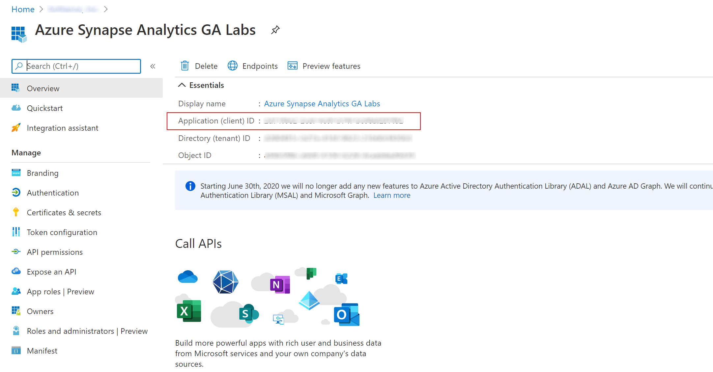

To view the secret, open the Azure Portal and navigate to the Azure Key Vault instance that has been created in your resource group. Select the `Secrets` section and you should see the `ASA-GA-LABS` secret:

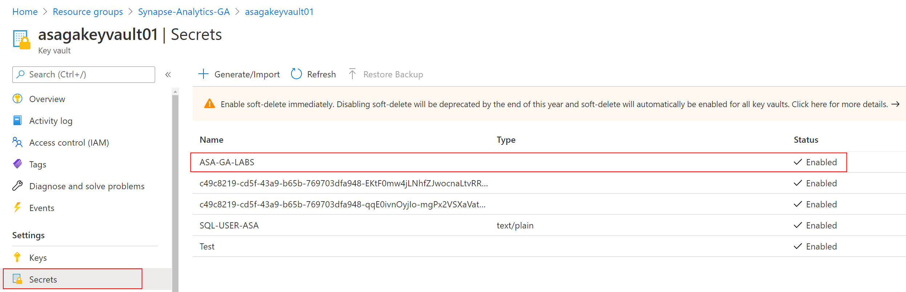

First, you need to make sure the service principal has permissions to work with the Azure Machine Learning workspace. Open the Azure Portal and navigate to the Azure Machine Learning workspace that has been created in your resource group. Select the `Access control (IAM)` section on the left, then select `+ Add` and `Add role assignment`. In the `Add role assignment` dialog, select the `Contributor` role, select `Azure Synapse Analytics GA Labs` service principal, and the select `Save`.

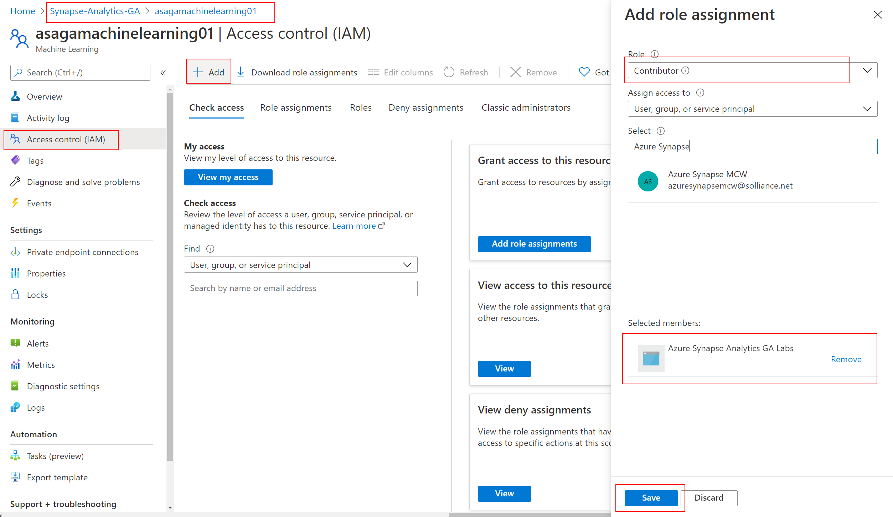

You are now ready to create the Azure Machine Learning linked service.

To create a new linked service, open your Synapse workspace, open Synapse Studio, select the `Manage` hub, select `Linked services`, and the select `+ New`. In the search field from the `New linked service` dialog, enter `Azure Machine Learning`. Select the `Azure Machine Learning` option and then select `Continue`.

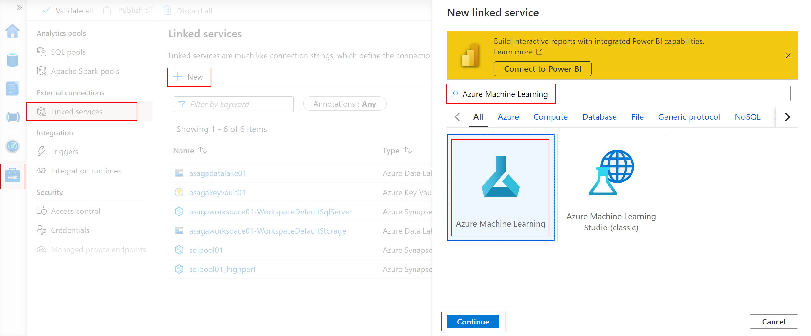

In the `New linked service (Azure Machine Learning)` dialog, provide the following properties:

- Name: enter `asagamachinelearning01`.
- Azure subscription: make sure the Azure subscription containing your resource group is selected.
- Azure Machine Learning workspace name: make sure your Azure Machine Learning workspace is selected.
- Notice how `Tenant identifier` has been already filled in for you.
- Service principal ID: enter the application client ID that you copied earlier.
- Select the `Azure Key Vault` option.
- AKV linked service: make sure your Azure Key Vault service is selected.
- Secret name: enter `ASA-GA-LABS`.

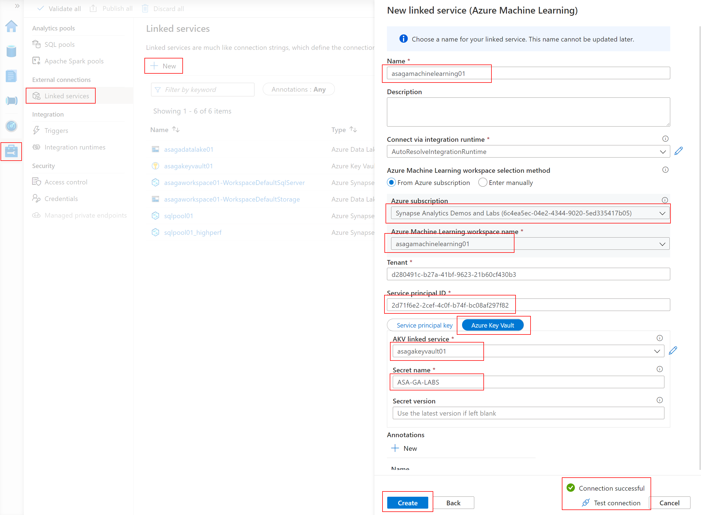

Next, select `Test connection` to make sure all settings are correct, and then select `Create`. The Azure Machine Learning linked service will now be created in the Synapse Analytics workspace.

>**IMPORTANT**
>
>The linked service is not complete until you publish it to the workspace. Notice the indicator near your Azure Machine Learning linked service. To publish it, select `Publish all` and then `Publish`.


### Task 2 - Explore Azure Machine Learning integration features in Synapse Studio

First, we need to create a Spark table as a starting point for the Machine Learning model trainig process. In Synapse Studio, select the `Data` hub and then the `Linked` section. In the primary `Azure Data Lake Storage Gen 2` account, select the `wwi-02` file system, and then select the `sale-small-20191201-snappy.parquet` file under `wwi-02\sale-small\Year=2019\Quarter=Q4\Month=12\Day=20191201`. Right click the file and select `New notebook -> New Spark table`.

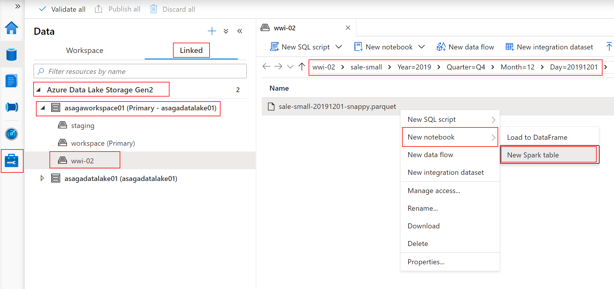

Replace the content of the notebook cell with the following code and then run the cell:

```python
import pyspark.sql.functions as f

df = spark.read.load('abfss://wwi-02@<data_lake_account_name>.dfs.core.windows.net/sale-small/Year=2019/Quarter=Q4/Month=12/*/*.parquet',
    format='parquet')
df_consolidated = df.groupBy('ProductId', 'TransactionDate', 'Hour').agg(f.sum('Quantity').alias('TotalQuantity'))
df_consolidated.write.mode("overwrite").saveAsTable("default.SaleConsolidated")
```

>**NOTE**:
>
>Replace `<data_lake_account_name>` with the actual name of your Synapse Analytics primary data lake account.

The code takes all data available for December 2019 and aggregates it at the `ProductId`, `TransactionDate`, and `Hour` level, calculating the total product quantities sold as `TotalQuantity`. The result is then saved as a Spark table named `SaleConsolidated`. To view the table in the `Data`hub, expand the `default (Spark)` database in the `Workspace` section. Your table will show up in the `Tables` folder. Select the three dots at the right of the table name to view the `Machine Learning` option in the context menu.

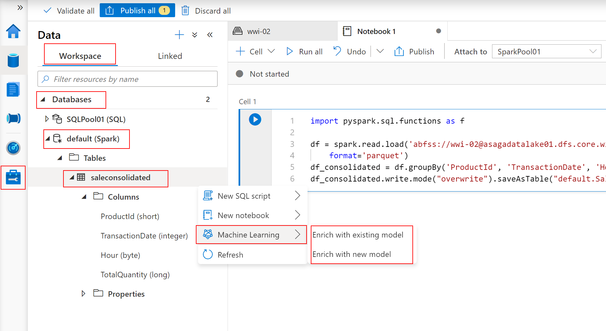

The following options are available in the `Machine Learning` section:

- Enrich with new model: allows you to start an AutoML experiment to train a new model.
- Enrich with existing model: allows you to use an existing Azure Cognitive Services model.

## Exercise 2 - Trigger an Auto ML experiment using data from a Spark table

In this exercise, you will trigger the execution of an Auto ML experiment and view its progress in Azure Machine learning studio.

### Task 1 - Trigger a regression Auto ML experiment on a Spark table

To trigger the execution of a new AutoML experiment, select the `Data` hub and then select the `...` area on the right of the `saleconsolidated` Spark table to activate the context menu.


From the context menu, select `Enrich with new model`.


The `Enrich with new model` dialog allow you to set the properties for the Azure Machine Learning experiment. Provide values as follows:

- **Azure Machine Learning workspace**: leave unchanged, should be automaticall populated with your Azure Machine Learning workspace name.
- **Experiment name**: leave unchanged, a name will be automatically suggested.
- **Best model name**: leave unchanged, a name will be automatically suggested. Save this name as you will need it later to identify the model in the Azure Machine Learning Studio.
- **Target column**: Select `TotalQuantity(long)` - this is the feature you are looking to predict.
- **Spark pool**: leave unchanged, should be automaticall populated with your Spark pool name.


Notice the Apache Spark configuration details:

- The number of executors that will be used
- The size of the executor

Select `Continue` to advance with the configuration of your Auto ML experiment.

Next, you will choose the model type. In this case, the choice will be `Regression` as we try to predict a continuous numerical value. After selecting the model type, select `Continue` to advance.

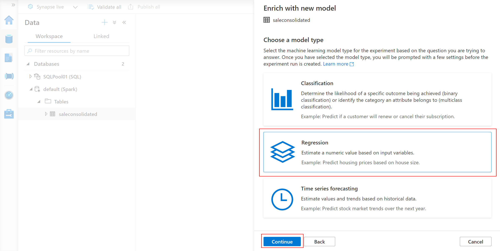

On the `Configure regression model` dialog, provide values as follows:

- **Primary metric**: leave unchanged, `Spearman correlation` should be suggested by default.
- **Training job time (hours)**: set to 0.25 to force the process to finish after 15 minutes.
- **Max concurrent iterations**: leave unchanged.
- **ONNX model compatibility**: set to `Enable` - this is very important as currently only ONNX models are supported in the Synapse Studio integrated experience.

Once you have set all the values, select `Create run` to advance.

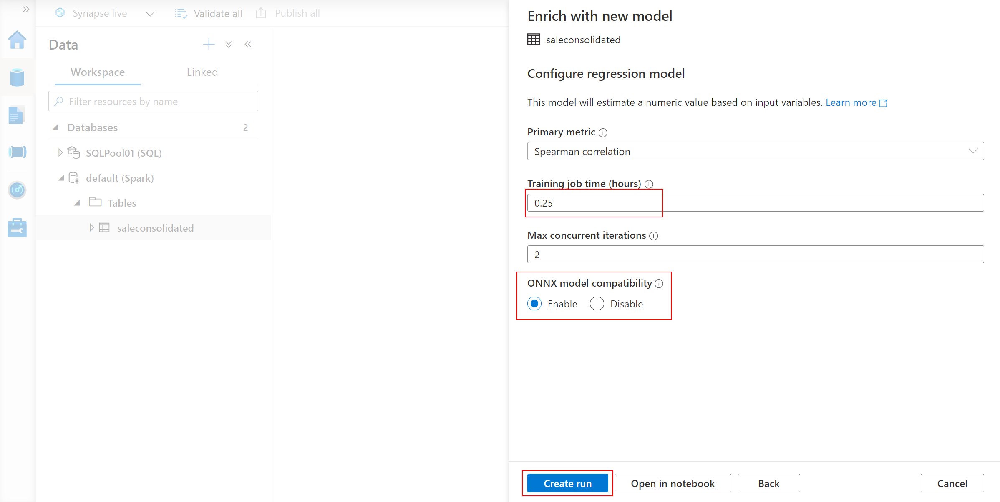

As your run is being submitted, a notification will pop up instructing you to wait until the Auto ML run is submited. You can check the status of the notification by selecting the `Notifications` icon on the top right part of your screen.

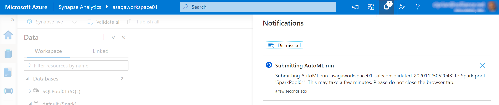

Once your run is successfully submitted, you will get another notification that will inform you about the actual start of the Auto ML experiment run.

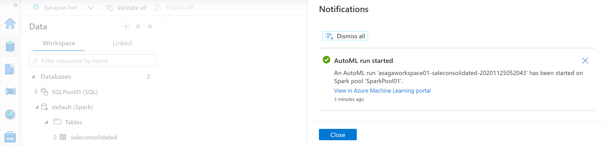

>**NOTE**
>
>Alongside the `Create run` option you might have noticed the `Open in notebook option`. Selecting that option allows you to review the actual Python code that is used to submit the Auto ML run. As an exercise, try re-doing all the steps in this task, but instead of selecting `Create run`, select `Open in notebook`. You should see a notebook similar to this:
>
>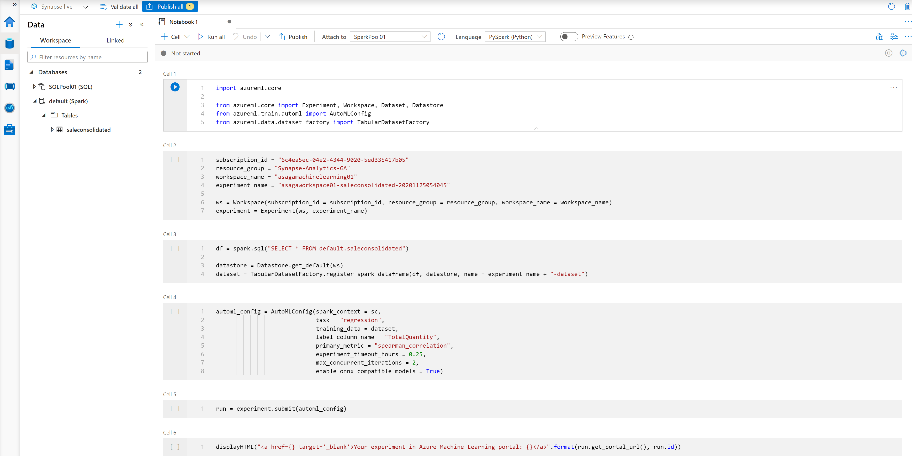
>
>Take a moment to read through the code that is generated for you. The total time elapsed for the experiment run will take around 20 minutes.

### Task 2 - View experiment details in Azure Machine Learning workspace

To view the experiment run you just started, open the Azure Portal, select your resource group, and then select the Azure Machine Learning workspace from the resource group.

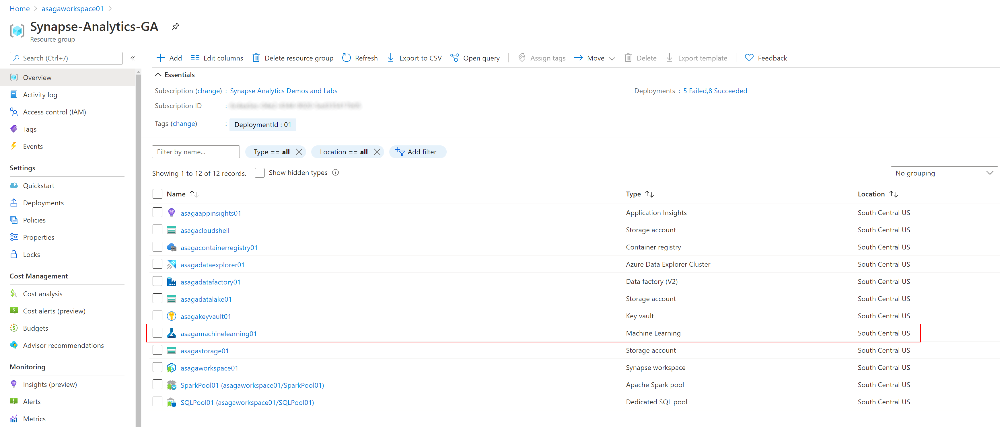

Locate and select the `Launch studio` button to start the Azure Machine Learning Studio.

In Azure Machine Leanring Studio, select the `Automated ML` section on the left and identify the experiment run you have just started. Note the experiment name, the `Running status`, and the `local` compute target.

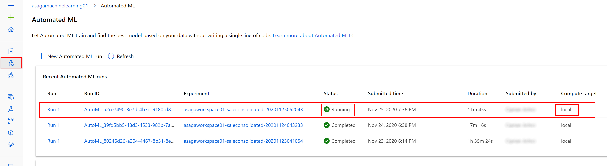

The reason why you see `local` as the compute target is because you are running the AutoML experiment on the Spark pool inside Synapse Analytics. From the point of view of Azure Machine Learning, you are not running your experiment on Azure Machine Learning's compute resources, but on your "local" compute resources.

Select your run, and then select the `Models` tab to view the current list of models being built by your run. The models are listed in descending order of the metric value (which is `Spearman correlation` in this case), the best ones being listed first.

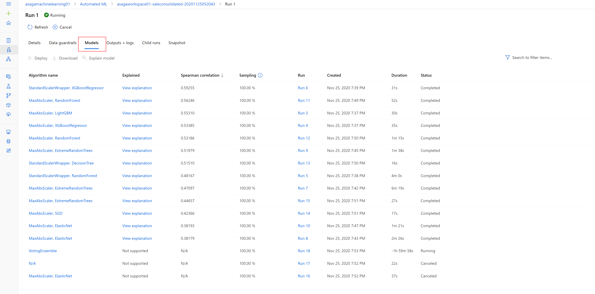

Select the best model (the one at the top of the list) then click on `View Explanations` to open the `Explanations (preview)` tab to see the model explanation. You are now able to select one of the explanations, then choose `Aggregates` to see the global importance of the input features. For your model, the feature that influences the most the value of the predicted value is   `ProductId`.

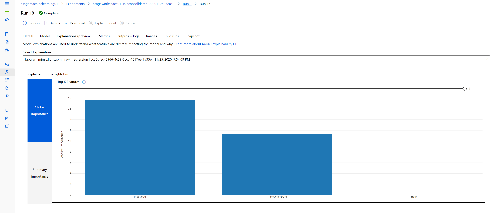

Next, select the `Models` section on the left in Azure Machine Learning Studio and see your best model registered with Azure Machine Learning. This allows you to refer to this model later on in this lab.

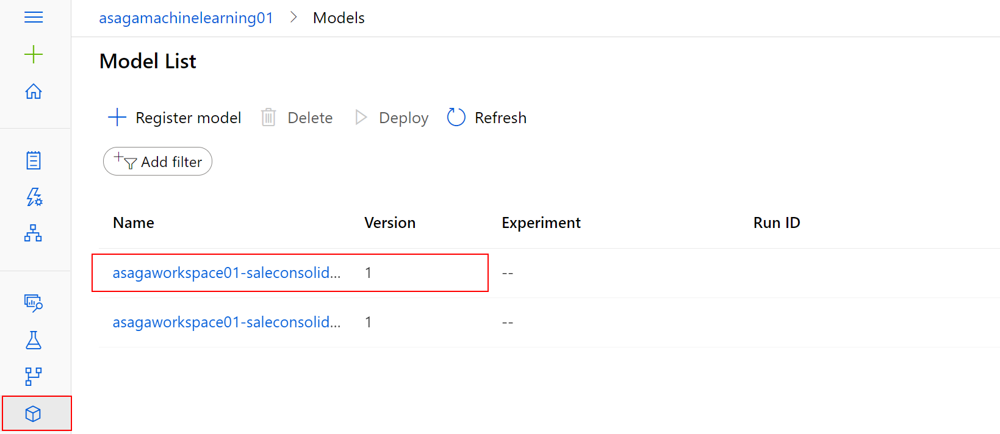

## Exercise 3 - Enrich data using trained models

In this exercise, you will use existing trained models to perform predictions on data. Task 1 uses a trained model from Azure Machine Learning services while Task 2 uses one from Azure Cognitive Services. Finally, you will include the prediciton stored procedure created in Task 1 into a Synapse pipeline.

### Task 1 - Enrich data in a SQL pool table using a trained model from Azure Machine Learning

In Synapse Studio, select the `Data` hub, then select the `Workspace` tab, and then locate the `wwi.ProductQuantityForecast` table in the `SQLPool01 (SQL)` database (under `Databases`). Activate the context menu by selecting `...` from the righ side of the table name, and then select `New SQL script > Select TOP 100 rows`. The table contains the following columns:

-**ProductId**: the identifier of the product for which we want to predict
-**TransactionDate**: the future date for which we want to predict
-**Hour**: the hour from the future date for which we want to predict
-**TotalQuantity**: the value we want to predict for the specified product, day, and hour.

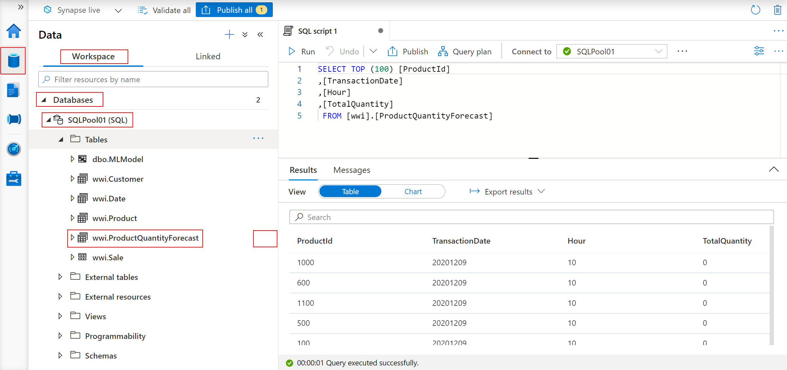

Notice that `TotalQuantity` is zero in all rows as this is the placeholder for the predicted values we are looking to get.

To use the model you just trained in Azure Machine Learning, activate the context menu of the `wwi.ProductQuantityForecast`, and then select `Machine Learning > Enrich with existing model`. This will open the `Enrich with existing model` dialog where you can select your model. Select the most recent model and then select `Continue`.


Next, you will manage the input and output column mappings. Because the column names from the target table and the table used for model training match, you can leave all mappings as suggested by default. Select `Continue` to advance.

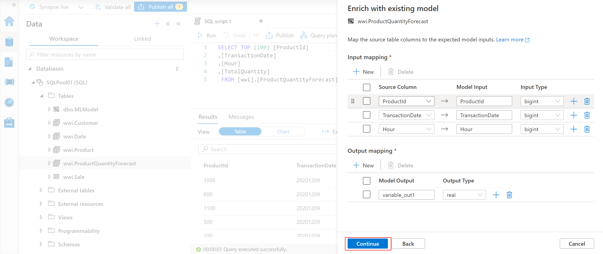

The final step presents you with options to name the stored procedure that will perform the predictions and the table that will store the serialized form of your model. Provide the following values:

- **Stored procedure name**: `[wwi].[ForecastProductQuantity]`
- **Select target table**: `Create new`
- **New table**: `[wwi].[Model]`

Select `Deploy model + open script` to deploy your model into the SQL pool.

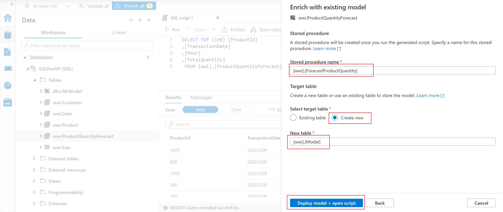

From the new SQL script that is created for you, copy the ID of the model:

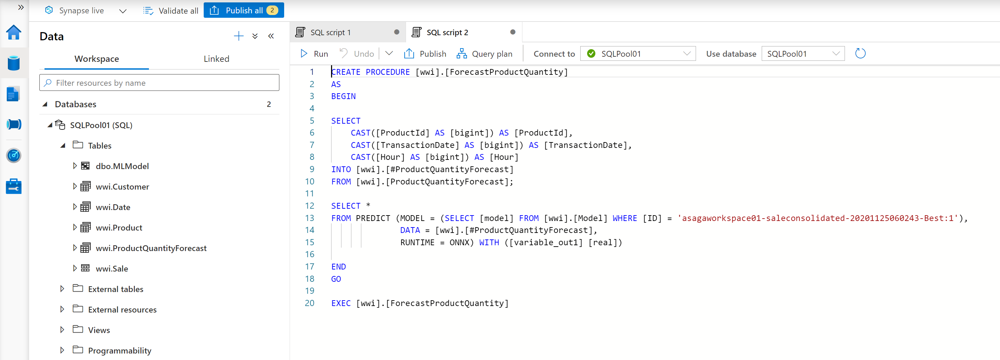

The T-SQL code that is generated will only return the results of the prediction, without actually saving them. To save the results of the prediction directly into the `[wwi].[ProductQuantityForecast]` table, replace the generated code with the following:

```sql
CREATE PROC [wwi].[ForecastProductQuantity] AS
BEGIN

SELECT
    CAST([ProductId] AS [bigint]) AS [ProductId],
    CAST([TransactionDate] AS [bigint]) AS [TransactionDate],
    CAST([Hour] AS [bigint]) AS [Hour]
INTO #ProductQuantityForecast
FROM [wwi].[ProductQuantityForecast]
WHERE TotalQuantity = 0;

SELECT
    ProductId
    ,TransactionDate
    ,Hour
    ,CAST(variable_out1 as INT) as TotalQuantity
INTO
    #Pred
FROM PREDICT (MODEL = (SELECT [model] FROM wwi.Model WHERE [ID] = '<your_model_id>'),
            DATA = #ProductQuantityForecast,
            RUNTIME = ONNX) WITH ([variable_out1] [real])

MERGE [wwi].[ProductQuantityForecast] AS target  
    USING (select * from #Pred) AS source (ProductId, TransactionDate, Hour, TotalQuantity)  
ON (target.ProductId = source.ProductId and target.TransactionDate = source.TransactionDate and target.Hour = source.Hour)  
    WHEN MATCHED THEN
        UPDATE SET target.TotalQuantity = source.TotalQuantity;
END
GO
```

In the code above, make sure you replace `<your_model_id>` with the actual ID of the model (the one you copied in the previous step).

>**NOTE**:
>
>Our version of the stored procedure uses the `MERGE` commdand to update the values of the `TotalQuantity` field in-place, in the `wwi.ProductQuantityForecast` table. The `MERGE` command has been recently added to Azure Synapse Analytics. For more details, read [New MERGE command for Azure Synapse Analytics](https://azure.microsoft.com/en-us/updates/new-merge-command-for-azure-synapse-analytics/).

You are now ready to perform the forecast on the `TotalQuantity` column. Open a new SQL script and run the following statement:

```sql
EXEC
    wwi.ForecastProductQuantity

SELECT  
    *
FROM
    wwi.ProductQuantityForecast
```

Notice how the values in the `TotalQuantity` column have changed from zero to non-zero predicted values:

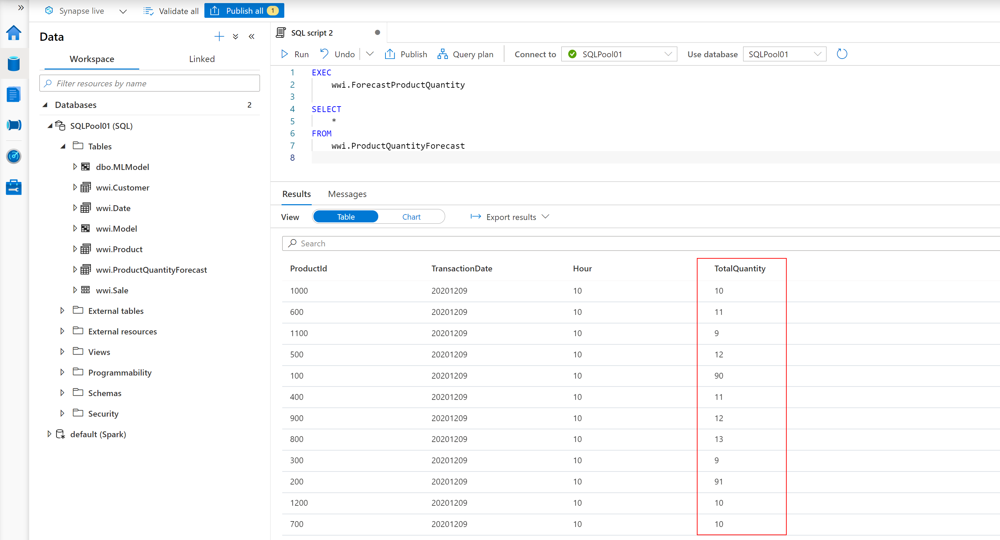

### Task 2 - Enrich data in a Spark table using a trained model from Azure Cognitive Services

First, we need to create a Spark table to be used as the input for the Cognitive Services model. In Synapse Studio, select the `Data` hub and then the `Linked` section. In the primary `Azure Data Lake Storage Gen 2` account, select the `wwi-02` file system, and then select the `ProductReviews.csv` file under `wwi-02\sale-small-product-reviews`. Right click the file and select `New notebook -> New Spark table`.

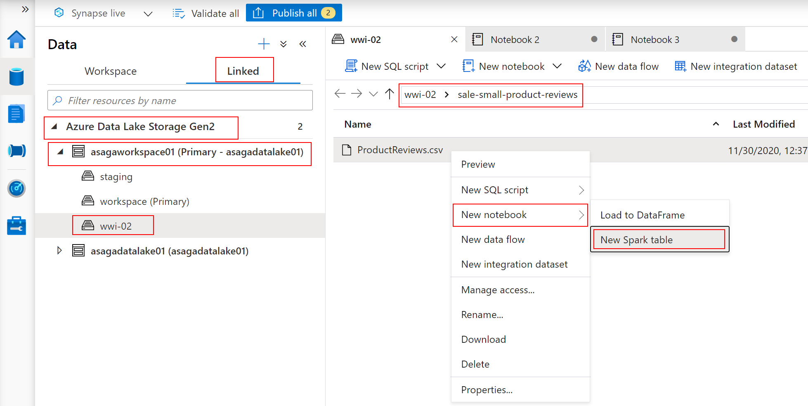

Replace the content of the notebook cell with the following code and then run the cell:

```python
%%pyspark
df = spark.read.load('abfss://wwi-02@<data_lake_account_name>.dfs.core.windows.net/sale-small-product-reviews/ProductReviews.csv', format='csv'
,header=True
)
df.write.mode("overwrite").saveAsTable("default.ProductReview")
```

>**NOTE**:
>
>Replace `<data_lake_account_name>` with the actual name of your Synapse Analytics primary data lake account.

To view the table in the `Data`hub, expand the `default (Spark)` database in the `Workspace` section. Your table will show up in the `Tables` folder. Select the three dots at the right of the table name to view the `Machine Learning` option in the context menu and then select `Machine Learning > Enrich with existing model`.

In the `Enrich with existing model` dialog, select `Text Analytics - Sentiment Analysis` under `Azure Cognitive Services` and then select `Continue`.

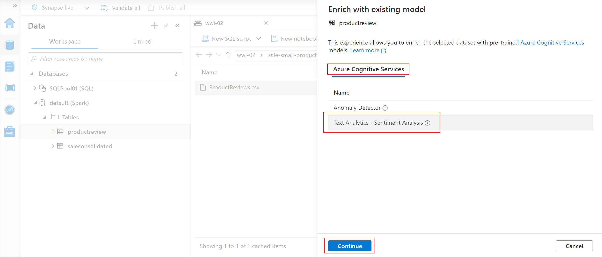

Next, provide values as follows:

- **Azure subscription**: select the Azure subscription of your resource group.
- **Cognitive Services account**: select the Cogntive Services account that has been provisioned in your resource group. The name should be `asagacognitiveservices<unique_suffix>`, where `<unique_suffix>` is the unique suffix you provided when deploying the Synapse Analytics workspace.
- **Azure Key Vault linked service**: select the Azure Key Vault linked services that has been provisioned in your Synapse Analytics workspace. The name should be `asagakeyvault<unique_suffix>`, where `<unique_suffix>` is the unique suffix you provided when deploying the Synapse Analytics workspace.
- **Secret name**: enter `ASA-GA-COGNITIVE-SERVICES` (the name of the secret that contains the key for the specified Cognitive Services account).

Select `Continue` to move next.

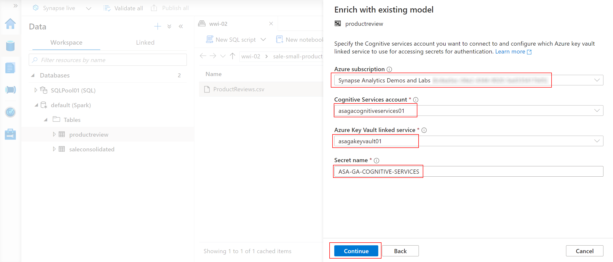

Next, provide values as follows:

- **Language**: select `English`.
- **Text column**: select `ReviewText (string)`

Select `Open notebook` to view the generated code.

>**NOTE**:
>
>When you created the `ProductReview` Spark table by running the notebook cell, you started a Spark session on that notebook. The default settings on your Synapse Analytics workspace will not allow you to start a new notebook that runs in parallel with that one.
You will need to copy the contents of the two cells that contain to Cognitive Services integration code into that notebook and run them on the Spark session that you have already started. After copying the two cells, you should see a screen similar to this:
>
>

>**NOTE**:
>To run the notebook generated by Synapse Studio without copying its cells, you can use the `Apache Spark applications` section of the `Monitor` hub where you can view and cancel running Spark session. For more details on this, see [Use Synapse Studio to monitor your Apache Spark applications](https://docs.microsoft.com/en-us/azure/synapse-analytics/monitoring/apache-spark-applications). In this lab, we used to copy cells approach to avoid the extra time required to cancel the running Spark session and start a new one afterwards.

Run cells 2 and 3 in the notebook to get the sentiment analysis results for your data.

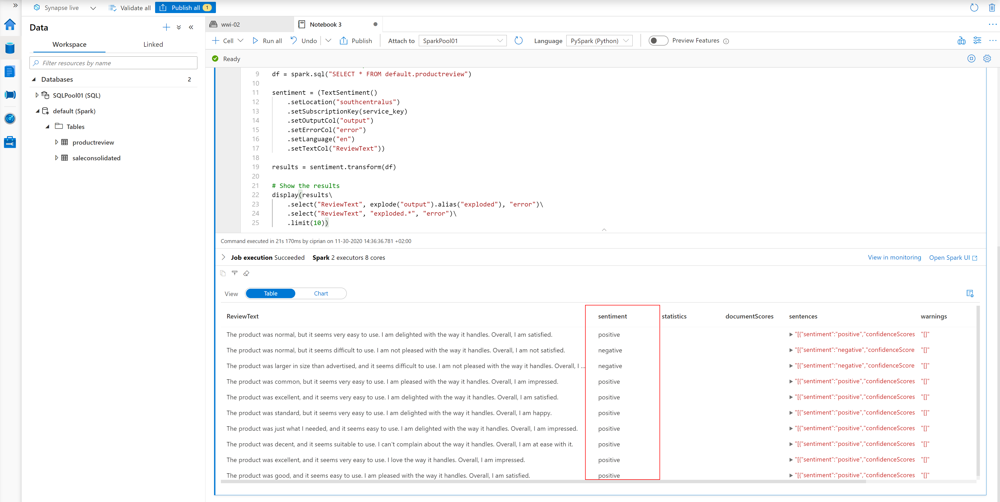

### Task 3 - Integrate a Machine Learning-based enrichment procedure in a Synapse pipeline

In Synapse studio, select the `Integrate` hub on the left side and then select `+ > Pipeline` to create a new Synapse pipeline.

Enter `Product Quantity Forecast` as the name of the pipeline on the right side.

From the `Move & transform` section, add a `Copy data` activity and name it `Import forecast requests`.


In the `Source` section of the copy activity properties, provide the following values:

- **Source dataset**: select the `wwi02_sale_small_product_quantity_forecast_adls` dataset.
- **File path type**: select `Wildcard file path`
- **Wildcard paths**: enter `sale-small-product-quantity-forecast` in the first textbox, and `*.csv` in the second.


In the `Sink` section of the copy activity properties, provide the following values:

-**Sink dataset**: select the `wwi02_sale_small_product_quantity_forecast_asa` dataset.


In the `Mapping` section of the copy activity properties, select `Import schemas` and check field mappings between source and sink.

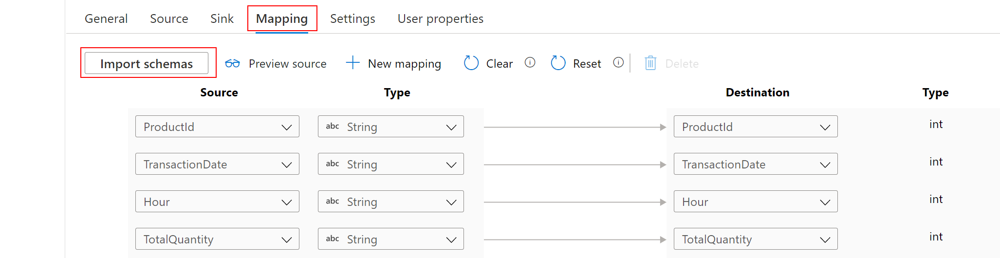

In the `Settings` section of the copy activity properties, provide the following values:

- **Enable staging**: select the option.
- **Staging account linked service**: select the `asagadatalake<unique_suffix>` linked service (where `<unique_suffix>` is the unique suffix you provided when deploying the Synapse Analytics workspace).
- **Storage path**: enter `staging`.

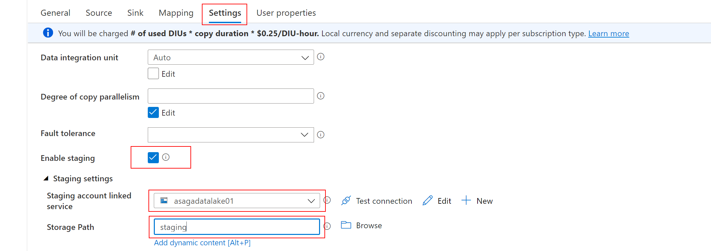

From the `Synapse` section, add a `SQL pool stored procedure` activity and name it `Forecast product quantities`. Connect the two pipeline activities to ensure the stored procedure runs after the data import.

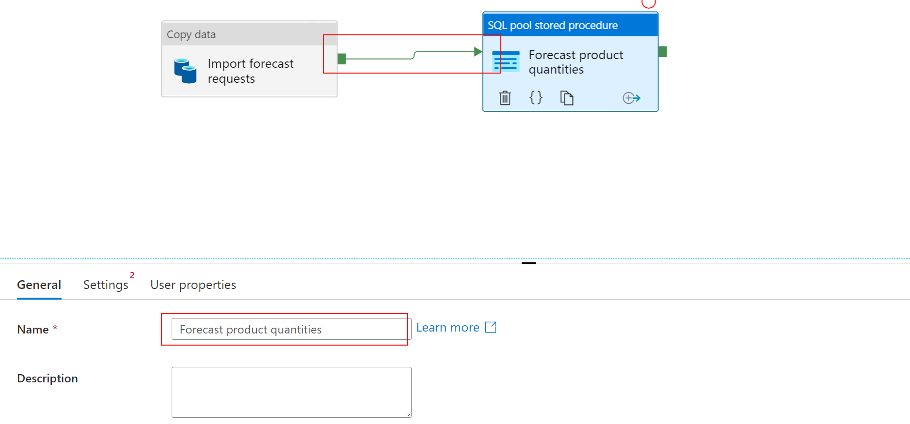

In the `Settings` section of the stored procedure actity properties, provide the following values:

- **Azure Synapse dedicated SQL pool**: select `SQLPool01`.
- **Stored procedure name**: select `[wwi].[ForecastProductQuantity]`.

Select `Debug` to make sure the pipeline works correctly.
Select `Publish all` to publish the pipeline.

Create a new SQL script and execute the following script against the `SQLPool01` pool:

```sql
SELECT  
    *
FROM
    wwi.ProductQuantityForecast
```

In the results you should now see forecasted values for Hour = 11 (which are corresponding to rows imported by the pipeline):

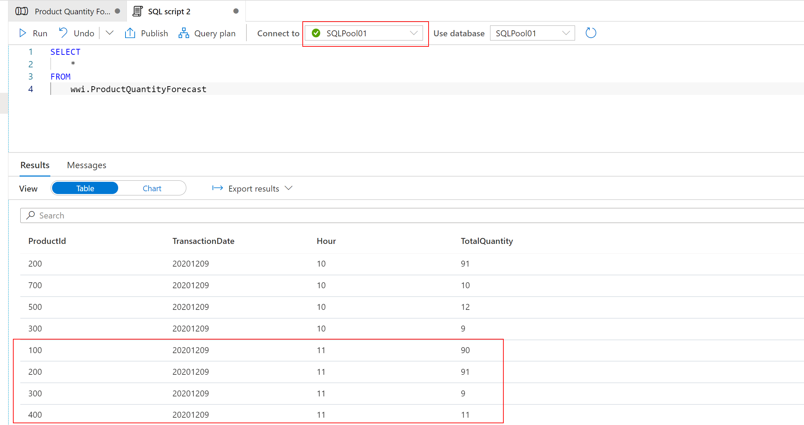

## Exercise 4 - Serve prediction results using Power BI

In this exercise you will view the prediction results in a Power BI report. You will also trigger the forecast pipeline with new input data and view the updated quantites in the Power BI report.

### Task 1 - Display prediction results in a Power BI report

First, you will publish a simple Product Quantity Forecast report to Power BI.

Download the `ProductQuantityForecast.pbix` file from the GitHub repo: https://github.com/solliancenet/azure-synapse-analytics-ga-content-packs/blob/main/hands-on-labs/lab-01/ProductQuantityForecast.pbix (select `Download` on the GitHub page).

Open the file with Power BI Desktop (ignore the warning about missing credentials). Also, if you are first prompted to update credentials, ignore the messages and close the pop-ups without updating the connection information.

In the `Home` section, select `Transform data`, then edit the `Source` entry in the `APPLIED STEPS` list of the `ProductQuantityForecast` query. Change the name of the server to `asagaworkspace<unique_suffix>.sql.azuresynapse.net` (where `<unique_suffix>` is the unique suffix you provided when deploying the Synapse Analytics workspace).

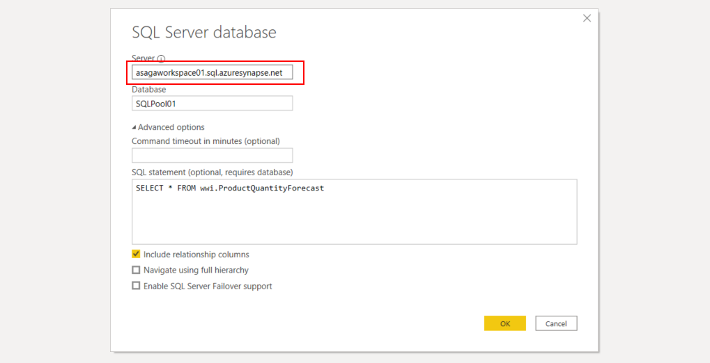

The credentials window will pop up and promopt you to enter the credentials to connect to the Synapse Analytics SQL pool (in case it doesn't, select `Data source settings` on the ribbon, select your data source, select `Edit Permissions...`, and then select `Edit...` under `Credentials`).

In the credentials window, select `Microsoft account` and then select `Sign in`. Use your Power BI Pro account to sign in.

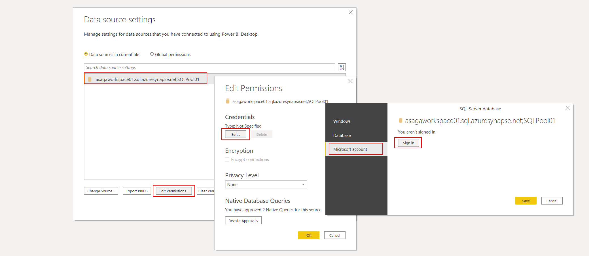

Close all open popup windows, select `Close & Apply` and then publish the file to your Power BI workspace.

To view the results of the report, in Synapse Studio, select the `Develop` hub on the left side, expand the `Power BI` section, and select the `ProductQuantityForecast` report under the `Power BI reports` section from your workspace.

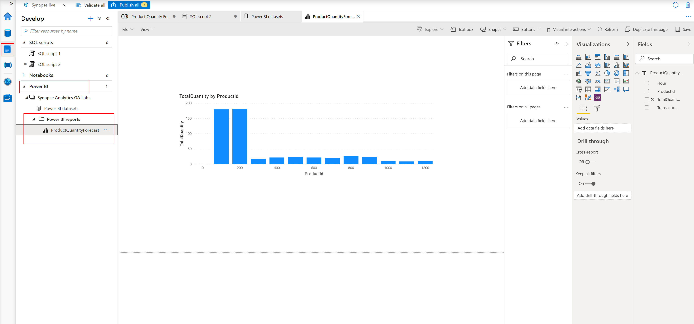

### Task 2 - Trigger the pipeline using an event-based trigger

In Synapse Studio, select the `Integrate` hub on the left side and open the `Product Quantity Forecast` pipeline. Select `+ Add trigger` and specify that you want to create a new pipeline trigger. In the `New trigger` window, provide the following values:

- **Name**: enter `New data trigger`.
- **Type**: select `Event`.
- **Azure subscription**: ensure the right Azure subscription is selected (the one containing your resource group).
- **Storage account name**: select the `asagadatalake<uniqu_prefix>` account (where `<unique_suffix>` is the unique suffix you provided when deploying the Synapse Analytics workspace).
- **Container name**: enter `wwi-02`.
- **Blob path begins with**: enter `sale-small-product-quantity-forecast/ProductQuantity`.
- **Event**: select `Blob created`.

Select `Continue` to create the trigger, then select once more `Continue` in the `Data preview` dialog, and then `OK` to publish the trigger.

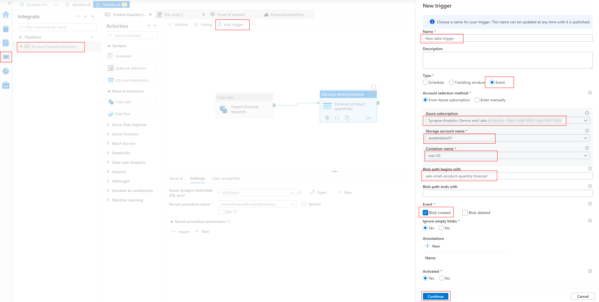

In Synapse Studio, select `Publish all` and then `Publish` to publish all changes.

Download the `ProductQuantity-20201209-12.csv` file from https://solliancepublicdata.blob.core.windows.net/wwi-02/sale-small-product-quantity-forecast/ProductQuantity-20201209-12.csv.

In Synapse Studio, select the `Data` hub on the left side, navigate to the primary data lake account in the `Linked` section, and open the `wwi-02 > sale-small-product-quantity-forecast` path. Delete the existing `ProductQuantity-20201209-11.csv` file and upload the `ProductQuantity-20201209-12.csv` file. This will trigger the `Product Quantity Forecast` pipeline wich will import the forecast requests from the CSV file and run the forecasting stored procedure.

In Synapse Studio, select the `Monitor` hub on the left side, and then select `Trigger runs` to see the newly activated pipeline run. Once the pipeline is finished, refresh the Power BI report in Synapse Studio to view the updated data.

## After the hands-on lab

Follow the instructions in [Clean-up your subscription](./../setup/cleanup.md) to clean-up your environment after the hands-on lab.

## Resources

To learn more about the topics covered in this lab, use these resources:

- [Quickstart: Create a new Azure Machine Learning linked service in Synapse](https://docs.microsoft.com/en-us/azure/synapse-analytics/machine-learning/quickstart-integrate-azure-machine-learning)
- [Tutorial: Machine learning model scoring wizard for dedicated SQL pools](https://docs.microsoft.com/en-us/azure/synapse-analytics/machine-learning/tutorial-sql-pool-model-scoring-wizard)

## Report issues

In case you encounter any issues with the content in this repository, please follow the [How to report issues](./../../report-issues.md) guideline. We will try to address them as soon as possible. Please check your open issues to learn about their status.
