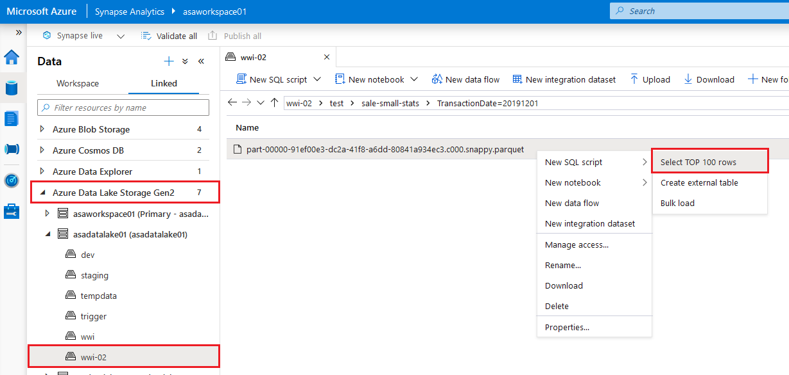
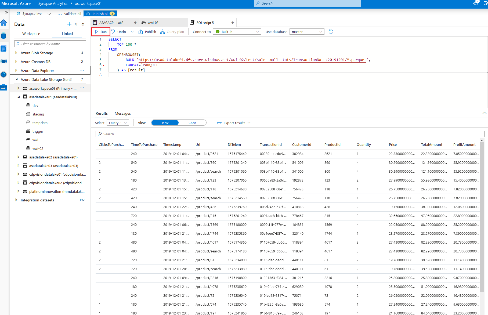

# Lab 02 - Working with Apache Spark in Synapse Analytics

This lab demonstrates the experience of working with Apache Spark in Azure Synapse Analytics. You will learn how to connect an Azure Synapse Analytics workspace to an Azure Data Explorer workspace using a Linked Service and then load data from one of its databases using a Spark notebook. You will also learn how to use libraries like Hyperspace and MSSparkUtil to optimize the experience of working with Data Lake storage accounts from Spark notebooks. In addition to Data Explorer and Data Lake storage, the data enrichment process will also use historical data from a SQL Pool. In the end, you will learn how to publish the enriched data back into the Data Lake and consume it with the SQL Built-in Pool and Power BI.

After completing the lab, you will understand the main steps of an end-to-end data enrichment process that uses Spark in an Azure Synapse Analytics workspace.

This lab has the following structure:

- [Before the hands-on lab](#before-the-hands-on-lab)
  - [Task 1 - Create and configure the Azure Synapse Analytics workspace](#task-1---create-and-configure-the-azure-synapse-analytics-workspace)
  - [Task 2 - Create and configure additional resources for this lab](#task-2---create-and-configure-additional-resources-for-this-lab)
- [Exercise 1 - Configure an Azure Data Explorer linked service](#exercise-1---configure-an-azure-data-explorer-linked-service)
  - [Task 1 - Create the linked service](#task-1---create-the-linked-service)
  - [Task 2 - Explore the Azure Data Explorer database in Synapse Studio](#task-2---explore-the-azure-data-explorer-database-in-synapse-studio)
- [Exercise 2 - Load and enrich data with Spark](#exercise-2---load-and-enrich-data-with-spark)
  - [Task 1 - Load data from Azure Data Explorer](#task-1---load-data-from-azure-data-explorer)
  - [Task 2 - Index the Data Lake storage with Hyperspace](#task-2---index-the-data-lake-storage-with-hyperspace)
  - [Task 3 - Explore the Data Lake storage with the MSSparkUtil library](#task-3---explore-the-data-lake-storage-with-the-mssparkutil-library)
  - [Task 4 - Load data from Data Lake storage](#task-4---load-data-from-data-lake-storage)
  - [Task 5 - Load data from SQL Pool](#task-5---load-data-from-sql-pool)
  - [Task 6 - Enrich data from multiple sources](#task-6---enrich-data-from-multiple-sources)
- [Exercise 3 - Consume enriched data](#exercise-3---consume-enriched-data)
  - [Task 1 - Access data with the SQL built-in pool](#task-1---access-data-with-the-sql-built-in-pool)
  - [Task 2 - Display enriched data in Power BI](#task-2---display-enriched-data-in-power-bi)
- [After the hands-on lab](#after-the-hands-on-lab)
- [Resources](#resources)

## Before the hands-on lab

Before stepping through the exercises in this lab, make sure you have properly configured your Azure Synapse Analytics workspace. Perform the tasks below to configure the workspace.

### Task 1 - Create and configure the Azure Synapse Analytics workspace

>**NOTE**
>
>If you have already created and configured the Synapse Analytics workspace while running one of the other labs available in this repo, you must not perform this task again and you can move on to the next task. The labs are designed to share the Synapse Analytics workspace, so you only need to create it once.

Follow the instructions in [Deploy your Azure Synapse Analytics workspace](./../setup/asa-workspace-deploy.md) to create and configure the workspace.

### Task 2 - Create and configure additional resources for this lab

Follow the instructions in [Deploy resources for Lab 02](./../setup/lab-02-deploy.md) to deploy additional resources for this lab. Once deployment is complete, you are ready to proceed with the exercises in this lab.

## Exercise 1 - Configure an Azure Data Explorer linked service

In this exercise, you will link your Synapse Analytics with an instance of Azure Data Explorer. This will allow you to explore Azure Data Explorer databases from Synapse Studio and use the Azure Data Explorer datasource in Spark queries.

### Task 1 - Create the linked service

The Synapse Analytics linked service authenticates with Azure Data Explorer using a service principal. The service principal is based on an Azure Active Directory application named `Azure Synapse Analytics GA Labs` and has already been created for you by the deployment procedure. The secret associated with the service principal has also been created and saved in the Azure Key Vault instance, under the `ASA-GA-LABS` name.

>**NOTE**
>
>In the labs provided by this repo, the Azure AD application is used in a single Azure AD tenant which means it has exactly one service principal associated to it. Consequently, we will use the terms Azure AD application and service principal interchangeably. For a detailed explanation on Azure AD applications and security principals, see [Application and service principal objects in Azure Active Directory](https://docs.microsoft.com/en-us/azure/active-directory/develop/app-objects-and-service-principals).

To view the service principal, open the Azure portal and navigate to your instance of Azure Active directory. Select the `App registrations` section and you should see the `Azure Synapse Analytics GA Labs` application under the `Owned applications` tab.


Select the application to view its properties and copy the value of the `Application (client) ID` property (you will need it in a moment to configure the linked service).


To view the secret, open the Azure Portal and navigate to the Azure Key Vault instance that has been created in your resource group. Select the `Secrets` section and you should see the `ASA-GA-LABS` secret:


First, you need to make sure the service principal has permissions to work with the Azure Data Explorer cluster and database. The setup procedure has already configured the necessary permissions, so you will just inspect them to make sure everything is in place.

Open the Azure Portal and navigate to the Azure Data Explorer cluster that has been created in your resource group. Select the `Databases` section on the left, then select the `ASA-Data-Explorer-DB-01` from the list of databases, and then select the `Permissions` section on the left. You should see the `Azure Synapse Analytica GA Labs` application listed under the `Database Admin` role.


You are now ready to create the Azure Data Explorer linked service.

To create a new linked service, open Synapse Studio, select the `Manage` hub, select `Linked services`, and the select `+ New`. In the search field from the `New linked service` dialog, enter `Azure Machine Learning`. Select the `Azure Machine Learning` option and then select `Continue`.


In the `New linked service (Azure Data Explorer (Kusto))` dialog, provide the following properties:

- **Name**: enter `asagadataexplorer01`.
- **Azure subscription**: make sure the Azure subscription containing your resource group is selected.
- **Cluster**: make sure your Azure Data Explorer cluster is selected.
- **Tenant**: notice how `Tenant identifier` has been already filled in for you.
- **Service principal ID**: enter the application client ID that you copied earlier.
- Select the `Azure Key Vault` option.
- **AKV linked service**: make sure your Azure Key Vault service is selected.
- **Secret name**: enter `ASA-GA-LABS`.
- **Database**: enter `ASA-Data-Explorer-DB-01`.


Next, select `Test connection` to make sure all settings are correct, and then select `Create`. The Azure Machine Learning linked service will now be created in the Synapse Analytics workspace.

>**IMPORTANT**
>
>The linked service is not complete until you publish it to the workspace. Notice the indicator near your Azure Machine Learning linked service. To publish it, select `Publish all` and then `Publish`.


### Task 2 - Explore the Azure Data Explorer database in Synapse Studio

Once the linked service is published, you can view the Azure Data Explorer databases and tables in Synapse Studio. Select the `Data` hub on the left site, then select the `Linked` section and the expand the `Azure Data Explorer` section to view the databases and tables under it. Activate the context menu next to the `SalesTelemetry` table by clicking on the `...` indicator (appears when you hover over the table name) and then select `New notebook > Read DataFrame from table`.


The notebook that is created for your shows how to load a Spark DataFrame from the `SalesTelemetry` table. Take a moment to observe the generated code, then select the `SparkPool01` Spark pool to attach to and run the cell. You will get the first 10 records from the table.


## Exercise 2 - Load and enrich data with Spark

In this exercise you will load data into Spark DataFrames from multiple sources and then perform enrichment steps to consolidate and correlate that data. In the process, you will explore the use of the `Hyperspace` indexing engine and of the `MSSparkUtil` library.

### Task 1 - Load data from Azure Data Explorer

To load all the data stored in the Data Explorer table, remove the `| take 10` part from line 10 and change line 13 into

```python
kustoDf.count()
```

Run the cell again. This time, the execution should take longer as the DataFrame is fully loaded with the content of the Data Explorer table. The loaded DataFrame contains 12.79 million records.


### Task 2 - Index the Data Lake storage with Hyperspace

Hyperspace introduces the ability for Apache Spark users to create indexes on their datasets, such as CSV, JSON, and Parquet, and use them for potential query and workload acceleration.

Hyperspace lets you create indexes on records scanned from persisted data files. After they're successfully created, an entry that corresponds to the index is added to the Hyperspace's metadata. This metadata is later used by Apache Spark's optimizer (with our extensions) during query processing to find and use proper indexes.

If the underlying data changes, you can refresh an existing index to capture that.

Hyperspace allows users to compare their original plan versus the updated index-dependent plan before running their query

```scala
%%spark

//
// Hyperspace: An indexing subsystem for Apache Spark
//
// https://docs.microsoft.com/en-us/azure/synapse-analytics/spark/apache-spark-performance-hyperspace?pivots=programming-language-scala
//
// 1. Indices are persistent, only create them once
// 2. Only creating index over HDFS file based scan nodes is supported.
//

import com.microsoft.hyperspace._
import com.microsoft.hyperspace.index._

// Disable BroadcastHashJoin, so Spark will use standard SortMergeJoin. Currently, Hyperspace indexes utilize SortMergeJoin to speed up query.
spark.conf.set("spark.sql.autoBroadcastJoinThreshold", -1)

val dfSales = spark.read.parquet("abfss://wwi-02@asadatalake01.dfs.core.windows.net/sale-small/Year=2019/Quarter=Q4/Month=12/*/*.parquet")
dfSales.show(10)

val dfCustomers = spark.read.format("csv").option("header", "true").load("abfss://wwi-02@asadatalake01.dfs.core.windows.net/data-generators/generator-customer-clean.csv")
dfCustomers.show(10)

//Create an instance of Hyperspace
val hyperspace: Hyperspace = Hyperspace()

//create indices: each one contains a name, a set of indexed columns and a set of included columns
val indexConfigSales = IndexConfig("indexSALES", Seq("CustomerId"), Seq("TotalAmount"))
val indexConfigCustomers = IndexConfig("indexCUSTOMERS", Seq("CustomerId"), Seq("FullName"))


hyperspace.indexes.show
//hyperspace.deleteIndex("indexSALES")
//hyperspace.vacuumIndex("indexSALES")
//hyperspace.deleteIndex("indexCUSTOMERS")
//hyperspace.vacuumIndex("indexCUSTOMERS")
hyperspace.createIndex(dfSales, indexConfigSales)             //only create index once
hyperspace.createIndex(dfCustomers, indexConfigCustomers)     //only create index once
hyperspace.indexes.show

//Enable Hyperspace - Hyperspace optimization rules become visible to the Spark optimizer and exploit existing Hyperspace indexes to optimize user queries
spark.enableHyperspace

//If the original data on which an index was created changes, the index will no longer capture the latest state of data. You can refresh a stale index
//hyperspace.refreshIndex("indexSALES")
//hyperspace.refreshIndex("indexCUSTOMERS")

val df1 = dfSales.filter("""CustomerId = 203""").select("""TotalAmount""")
df1.show()
df1.explain(true)

val df2 = dfCustomers.filter("""CustomerId = 203""").select("""FullName""")
df2.show()
df2.explain(true)

val eqJoin = dfSales.join(dfCustomers, dfSales("CustomerId") === dfCustomers("CustomerId")).select(dfSales("TotalAmount"), dfCustomers("FullName"))
eqJoin.show()
eqJoin.explain(true)

//Plan with indexes versus... Plan without indexes
//we should see this in the plan: InMemoryFileIndex[abfss://datasets@hyperspacebenchmark.dfs.core.windows.net/hyperspaceon...
spark.conf.set("spark.hyperspace.explain.displayMode", "html")
hyperspace.explain(eqJoin)(displayHTML(_))

//Disable Hyperspace - Hyperspace rules no longer apply during query optimization. Disabling Hyperspace has no impact on created indexes because they remain intact
//spark.disableHyperspace
```

Same example as above, this time using Python code

```python
%%pyspark

#
# Hyperspace: An indexing subsystem for Apache Spark
#
# https://docs.microsoft.com/en-us/azure/synapse-analytics/spark/apache-spark-performance-hyperspace?pivots=programming-language-python
#
# 1. Indices are persistent, only create them once
# 2. Only creating index over HDFS file based scan nodes is supported.
#

from hyperspace import *  
from com.microsoft.hyperspace import *
from com.microsoft.hyperspace.index import *

# Disable BroadcastHashJoin, so Spark will use standard SortMergeJoin. Currently, Hyperspace indexes utilize SortMergeJoin to speed up query.
spark.conf.set("spark.sql.autoBroadcastJoinThreshold", -1)

dfSales = spark.read.parquet("abfss://wwi-02@asadatalake01.dfs.core.windows.net/sale-small/Year=2019/Quarter=Q4/Month=12/*/*.parquet")
dfSales.show(10)

dfCustomers = spark.read.load("abfss://wwi-02@asadatalake01.dfs.core.windows.net/data-generators/generator-customer-clean.csv", format="csv", header=True)
dfCustomers.show(10)

# Create an instance of Hyperspace
hyperspace = Hyperspace(spark)

#create indices: each one contains a name, a set of indexed columns and a set of included columns
indexConfigSales = IndexConfig("indexSALES", ["CustomerId"], ["TotalAmount"])
indexConfigCustomers = IndexConfig("indexCUSTOMERS", ["CustomerId"], ["FullName"])


#hyperspace.indexes().show()
#hyperspace.deleteIndex("indexSALES")
#hyperspace.vacuumIndex("indexSALES")
#hyperspace.deleteIndex("indexCUSTOMERS")
#hyperspace.vacuumIndex("indexCUSTOMERS")
hyperspace.createIndex(dfSales, indexConfigSales)			# only create index once
hyperspace.createIndex(dfCustomers, indexConfigCustomers)	# only create index once
hyperspace.indexes().show()

#Enable Hyperspace - Hyperspace optimization rules become visible to the Spark optimizer and exploit existing Hyperspace indexes to optimize user queries
Hyperspace.enable(spark)

#If the original data on which an index was created changes, the index will no longer capture the latest state of data. You can refresh a stale index
#hyperspace.refreshIndex("indexSALES")
#hyperspace.refreshIndex("indexCUSTOMERS")

df1 = dfSales.filter("""CustomerId = 203""").select("""TotalAmount""")
df1.show()
df1.explain(True)

df2 = dfCustomers.filter("""CustomerId = 203""").select("""FullName""")
df2.show()
df2.explain(True)

eqJoin = dfSales.join(dfCustomers, dfSales.CustomerId == dfCustomers.CustomerId).select(dfSales.TotalAmount, dfCustomers.FullName)
eqJoin.show()
eqJoin.explain(True)

#Plan with indexes versus... Plan without indexes
#we should see this in the plan: InMemoryFileIndex[abfss://datasets@hyperspacebenchmark.dfs.core.windows.net/hyperspaceon...
spark.conf.set("spark.hyperspace.explain.displayMode", "html")
hyperspace.explain(eqJoin, True, displayHTML)

#Disable Hyperspace - Hyperspace rules no longer apply during query optimization. Disabling Hyperspace has no impact on created indexes because they remain intact
#Hyperspace.disable(spark)
```

When running the spark queries with Hyperspace enabled and indices are present, the query plan shows that the Hyperspace indices are being used.


### Task 3 - Explore the Data Lake storage with the MSSparkUtil library

Microsoft Spark Utilities (MSSparkUtils) is a builtin package to help you easily perform common tasks. You can use MSSparkUtils to work with file systems, to get environment variables, and to work with secrets.

```python
%%pyspark

from notebookutils import mssparkutils

#
# Microsoft Spark Utilities
#
# https://docs.microsoft.com/en-us/azure/synapse-analytics/spark/microsoft-spark-utilities?pivots=programming-language-python
#

# Azure storage access info
blob_account_name = 'asadatalake01'
blob_container_name = 'wwi-02'
blob_relative_path = '/'
linkedServiceName = 'asadatalake01'
blob_sas_token = mssparkutils.credentials.getConnectionStringOrCreds(linkedServiceName)

# Allow SPARK to access from Blob remotely
spark.conf.set('fs.azure.sas.%s.%s.blob.core.windows.net' % (blob_container_name, blob_account_name), blob_sas_token)

files = mssparkutils.fs.ls('/')
for file in files:
    print(file.name, file.isDir, file.isFile, file.path, file.size)

mssparkutils.fs.mkdirs('/SomeNewFolder')

files = mssparkutils.fs.ls('/')
for file in files:
    print(file.name, file.isDir, file.isFile, file.path, file.size)
```

### Task 4 - Load data from Data Lake storage

Use spark to read parquet files from DataLake

```python
%%pyspark
#load parquet as a spark dataframe
dfSales = spark.read.parquet('abfss://wwi-02@asadatalake01.dfs.core.windows.net/sale-small/Year=2019/Quarter=Q4/Month=12/*/*.parquet')
dfSales.printSchema()
dfSales.show(10)
```

### Task 5 - Load data from SQL Pool

Use spark to read SQLDB contents via the `sqlanalytics` connector. Only Scala is supported.

```scala
%%spark

import com.microsoft.spark.sqlanalytics.utils.Constants
import org.apache.spark.sql.SqlAnalyticsConnector._

//read from SQLDB
val dfProducts = spark.read.sqlanalytics("SQLPool02.wwi.Product") 
dfProducts.head(10)
```

### Task 6 - Enrich data from multiple sources

Using Spark we can perform powerful queries on all our data.

```scala
%%spark

import com.microsoft.spark.sqlanalytics.utils.Constants
import org.apache.spark.sql.SqlAnalyticsConnector._

import org.apache.spark.sql.functions.udf
import org.apache.spark.sql.expressions.Window

import java.time.LocalDate
import java.time.LocalDateTime
import java.time.Duration
import java.time.ZoneId
import java.time.format.DateTimeFormatter

val zoneId = ZoneId.systemDefault()

//
// 1. read customers/products from sqldb
//

//CustomerId,FirstName,MiddleInitial,LastName,FullName,Gender,Age,BirthDate,Address_PostalCode,Address_Street,Address_City,Address_Country,Mobile,Email
//val dfCustomers = spark.read.sqlanalytics("SQLPool02.wwi.Customer") 
//dfCustomers.show

//ProductId,Seasonality,Price,Profit
//val dfProducts = spark.read.sqlanalytics("SQLPool02.wwi.Product") 

//inner join to link sales with product details
//df1 = dfSales.join(dfProducts, dfSales.name == dfProducts.name)
//df2 = dfTelemetry.join(df1, (dfTelemetry.ProductId == df1.ProductId) & (dfTelemetry.CustomerId == df1.CustomerId))

//
// 2. read sales from datalake
//

//TransactionId,CustomerId,ProductId,Quantity,Price,TotalAmount,TransactionDate,ProfitAmount,Hour,Minute,StoreId
val dfSales = spark.read.parquet("abfss://wwi-02@asadatalake01.dfs.core.windows.net/sale-small/Year=2019/Quarter=Q4/Month=12/Day=20191201/*.parquet")

val func1 = udf((dt:String, hh:Int, mm:Int) => {
    val fmt = DateTimeFormatter.ofPattern("yyyyMMdd")
    val theDate =  LocalDate.parse(dt, fmt)
    val dtSales = LocalDateTime.of(theDate.getYear, theDate.getMonth, theDate.getDayOfMonth, hh, mm, 0, 0)
    dtSales.atZone(zoneId).toEpochSecond().toLong
})

val dfSales2 = dfSales.withColumn("DtSales", func1('TransactionDate, 'Hour, 'Minute))
dfSales2.show

//
// 3. read telemetry from ade/kusto
//

//CustomerId,ProductId,Timestamp,Url
val dfTelemetry = spark.read.format("csv").option("header", "true").load("abfss://wwi-02@asadatalake01.dfs.core.windows.net/sale-small-telemetry/telemData20191201new.csv")

//dfTelemetry  = spark.read \
//    .format("com.microsoft.kusto.spark.synapse.datasource") \
//    .option("spark.synapse.linkedService", "asadataexplorer01") \
//    .option("kustoDatabase", "ASA-Data-Explorer-DB-01") \
//    .option("kustoQuery", "ASA-Data-Explorer-DB-01-Table-01") \
//    .load()

val func2 = udf((tsTelem:String) => {
    val fmt2 = DateTimeFormatter.ofPattern("yyyy-MM-dd HH:mm:ss")
    val dtTelem =  LocalDateTime.parse(tsTelem, fmt2)

    dtTelem.atZone(zoneId).toEpochSecond().toLong
})
val dfTelemetry2 = dfTelemetry.withColumn("DtTelem", func2('Timestamp)).withColumnRenamed("CustomerId", "TCustomerId").withColumnRenamed("ProductId", "TProductId")
dfTelemetry2.show

//
// Enrichment
//

//match transactions with telemetry entries based on this fuzzy logic:
//a telemetry entry belongs to a transaction if it was logged during the 15 minutes before the transaction
val dfEnriched = dfTelemetry2.repartition(800).join(dfSales2, dfTelemetry2("TCustomerId")===dfSales2("CustomerId") && dfTelemetry2("TProductId")===dfSales2("ProductId")).withColumn("deltaSec", 'DtSales - 'DtTelem).where('deltaSec > 0 and 'deltaSec < 900).drop("TCustomerId").drop("TProductId")
dfEnriched.show

//compute the time-to-trans and clicks-to-trans
val windowSpec = Window.partitionBy($"TransactionId", $"ProductId", $"CustomerId").orderBy('Timestamp desc)
val countClicks = count('*).over(windowSpec)
val countTime = max('deltaSec).over(windowSpec)

val dfOut = dfEnriched.withColumn("ClicksBeforePurchase", countClicks).withColumn("SecondsBeforePurchase", countTime)
val dfResult = dfOut.groupBy($"TransactionId", $"ProductId", $"CustomerId").agg(max('ClicksBeforePurchase) as "ClicksToPurchase", max('SecondsBeforePurchase) as "TimeToPurchase")
dfResult.show

val df = dfResult.withColumnRenamed("CustomerId", "GCustomerId").withColumnRenamed("ProductId", "GProductId").withColumnRenamed("TransactionId", "GTransactionId")
df.show

val dfSaved = df.join(dfOut, df("GCustomerId")===dfOut("CustomerId") && df("GProductId")===dfOut("ProductId") && df("GTransactionId")===dfOut("TransactionId")).drop("GCustomerId").drop("GProductId").drop("GTransactionId")
dfSaved.show

//
// write output to datalake
//
//dfSaved.coalesce(1).write.partitionBy("TransactionDate").format("csv").option("header", "true").mode("overwrite").save("abfss://wwi-02@asadatalake01.dfs.core.windows.net/test/sale-small-stats")
dfSaved.coalesce(1).write.partitionBy("TransactionDate").parquet("abfss://wwi-02@asadatalake01.dfs.core.windows.net/test/sale-small-stats")

```

## Exercise 3 - Consume enriched data

The persisted output data will be now used for further analysis.

### Task 1 - Access data with the SQL built-in pool

&nbsp;

* Create SQL query: go to your datalake source, find the container and the path where enriched data is stored. Right click on the desired file, choose New SQL Script, pick one of the scripts.



By default an SQL query that allows us to browse the first rows in the dataset is generated. You can customize the SQL query.

```sql
SELECT
    TOP 100 *
FROM
    OPENROWSET(
        BULK 'https://asadatalake01.dfs.core.windows.net/wwi-02/test/sale-small-stats/TransactionDate=20191201/*.parquet',
        FORMAT='PARQUET'
    ) AS [result]
```
&nbsp;

Run query and view results: click on the Run button to execute your query and the lower pane will show the results.



Note that we can also create shared database/table metadata (between the Apache Spark pools and the SQL pool)

```python
%%pyspark

#
# create an external/unmanaged database/table from datalake information
#
# see https://docs.microsoft.com/en-us/azure/synapse-analytics/metadata/overview
#
spark.sql("CREATE DATABASE IF NOT EXISTS ASA_SPARK_DB01")
spark.sql("CREATE TABLE IF NOT EXISTS ASA_SPARK_DB01.salesmallstats201912 USING Parquet LOCATION 'https://asadatalake01.dfs.core.windows.net/wwi-02/test/sale-small-stats/TransactionDate=20191201/*.parquet'")

#since we now have table metadata, we can now use SQL queries (with or without spark)
dfExt = spark.sql("SELECT * FROM asa_spark_db01.salesmallstats201912")
dfExt.show(10)
```

### Task 2 - Display enriched data in Power BI

TODO

## After the hands-on lab

Follow the instructions in [Clean-up your subscription](./../setup/cleanup.md) to clean-up your environment after the hands-on lab.

## Resources

To learn more about the topics covered in this lab, use these resources:

- [Apache Spark in Azure Synapse Analytics](https://docs.microsoft.com/en-us/azure/synapse-analytics/spark/apache-spark-overview)
- [Announcing Azure Data Explorer data connector for Azure Synapse](https://techcommunity.microsoft.com/t5/azure-data-explorer/announcing-azure-data-explorer-data-connector-for-azure-synapse/ba-p/1743868)
- [Connect to Azure Data Explorer using Apache Spark for Azure Synapse Analytics](https://docs.microsoft.com/en-us/azure/synapse-analytics/quickstart-connect-azure-data-explorer)
- [Azure Synapse Analytics shared metadata](https://docs.microsoft.com/en-us/azure/synapse-analytics/metadata/overview)
- [Introduction of Microsoft Spark Utilities](https://docs.microsoft.com/en-us/azure/synapse-analytics/spark/microsoft-spark-utilities?pivots=programming-language-python)
- [Hyperspace - An open source indexing subsystem that brings index-based query acceleration to Apache Spark™ and big data workloads](https://github.com/microsoft/hyperspace)