# Lab 02 - Working with Apache Spark in Synapse Analytics

This lab demonstrates the experience of working with Apache Spark in Azure Synapse Analytics. You will learn how to connect an Azure Synapse Analytics workspace to an Azure Data Explorer workspace using a Linked Service and then load data from one of its databases using a Spark notebook. You will also learn how to use libraries like Hyperspace and MSSparkUtil to optimize the experience of working with Data Lake storage accounts from Spark notebooks. In addition to Data Explorer and Data Lake storage, the data enrichment process will also use historical data from a SQL Pool. In the end, you will learn how to publish the enriched data back into the Data Lake and consume it with the SQL Built-in Pool and Power BI.

After completing the lab, you will understand the main steps of an end-to-end data enrichment process that uses Spark in an Azure Synapse Analytics workspace.

This lab has the following structure:

- [Before the hands-on lab](#before-the-hands-on-lab)
  - [Task 1 - Create and configure the Azure Synapse Analytics workspace](#task-1---create-and-configure-the-azure-synapse-analytics-workspace)
  - [Task 2 - Create and configure additional resources for this lab](#task-2---create-and-configure-additional-resources-for-this-lab)
- [Exercise 1 - Configure an Azure Data Explorer linked service](#exercise-1---configure-an-azure-data-explorer-linked-service)
  - [Task 1 - Set up a service principal for authentication](#task-1---set-up-a-service-principal-for-authentication)
  - [Task 2 - Create the linked service](#task-2---create-the-linked-service)
  - [Task 3 - Explore the Azure Data Explorer database in Synapse Studio](#task-3---explore-the-azure-data-explorer-database-in-synapse-studio)
- [Exercise 2 - Load and enrich data with Spark](#exercise-2---load-and-enrich-data-with-spark)
  - [Task 1 - Load data from Azure Data Explorer](#task-1---load-data-from-azure-data-explorer)
  - [Task 2 - Index the Data Lake storage with Hyperspace](#task-2---index-the-data-lake-storage-with-hyperspace)
  - [Task 3 - Explore the Data Lake storage with the MSSparkUtil library](#task-3---explore-the-data-lake-storage-with-the-mssparkutil-library)
  - [Task 4 - Load data from Data Lake storage](#task-4---load-data-from-data-lake-storage)
  - [Task 5 - Load data from SQL Pool](#task-5---load-data-from-sql-pool)
  - [Task 6 - Enrich data from multiple sources](#task-6---enrich-data-from-multiple-sources)
- [Exercise 3 - Publish and consume enriched data](#exercise-3---publish-and-consume-enriched-data)
  - [Task 1 - Save enriched data to Data Lake storage](#task-1---save-enriched-data-to-data-lake-storage)
  - [Task 2 - Access data with the SQL built-in pool](#task-2---access-data-with-the-sql-built-in-pool)
  - [Task 3 - Display enriched data in Power BI](#task-3---display-enriched-data-in-power-bi)
- [After the hands-on lab](#after-the-hands-on-lab)
- [Resources](#resources)

## Before the hands-on lab

Before stepping through the exercises in this lab, make sure you have properly configured your Azure Synapse Analytics workspace. Perform the tasks below to configure the workspace.

### Task 1 - Create and configure the Azure Synapse Analytics workspace

>**NOTE**
>
>If you have already created and configured the Synapse Analytics workspace while running one of the other labs available in this repo, you must not perform this task again and you can move on to the next task. The labs are designed to share the Synapse Analytics workspace, so you only need to create it once.

Follow the instructions in [Deploy your Azure Synapse Analytics workspace](./../setup/asa-workspace-deploy.md) to create and configure the workspace.

### Task 2 - Create and configure additional resources for this lab

Follow the instructions in [Deploy resources for Lab 02](./../setup/lab-02-deploy.md) to deploy additional resources for this lab. Once deployment is complete, you are ready to proceed with the exercises in this lab.

## Exercise 1 - Configure an Azure Data Explorer linked service

We will link Azure Synapse with an instance of Azure Data Explorer.

This will allow us to use the Azure Data Explorer (Kusto) datasource in our Spark queries.

### Task 1 - Set up a service principal for authentication

We must register an Application before we can create the Linked Service.
Skip the steps below of you have already created an Application.

&nbsp;

* Go to App Registrations and create a new application

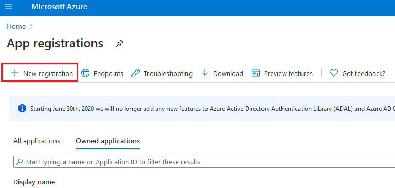

&nbsp;

* Choose a name for your application and press Register

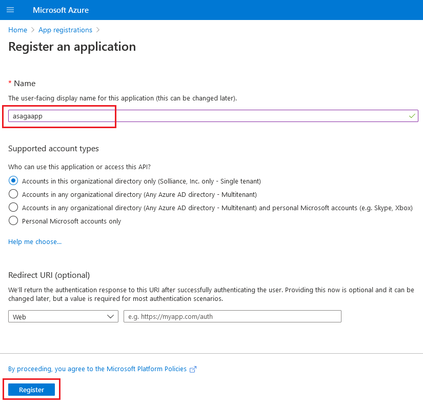

&nbsp;

* The new application must be configured, click on Certificates & Secrets

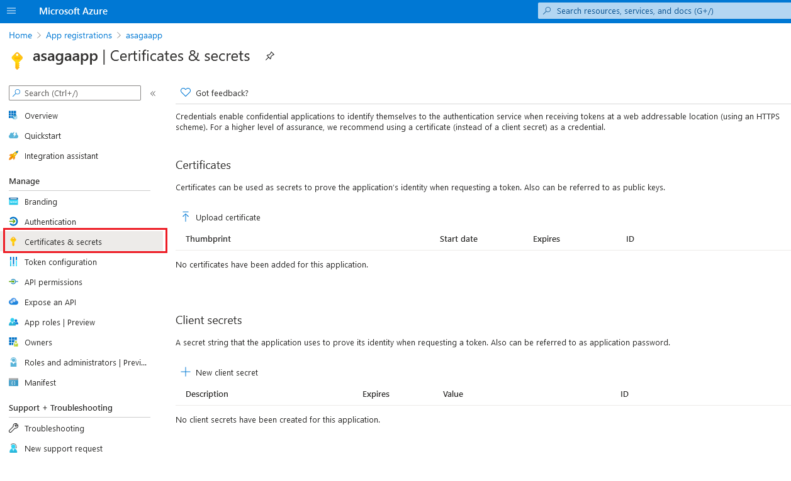

&nbsp;

* Choose a name for your new secret and press Add. The secret is now generated and ready to be used.

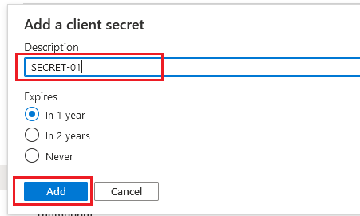

&nbsp;

* Your secret is only visible once. Keep a copy of it so that you can store it safely for further use.

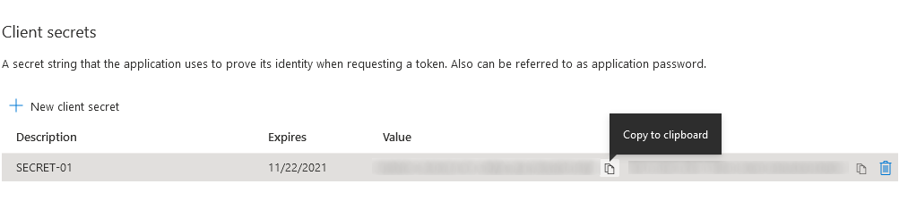


### Task 2 - Create the linked service

&nbsp;

* Open your Azure Synapse workspace

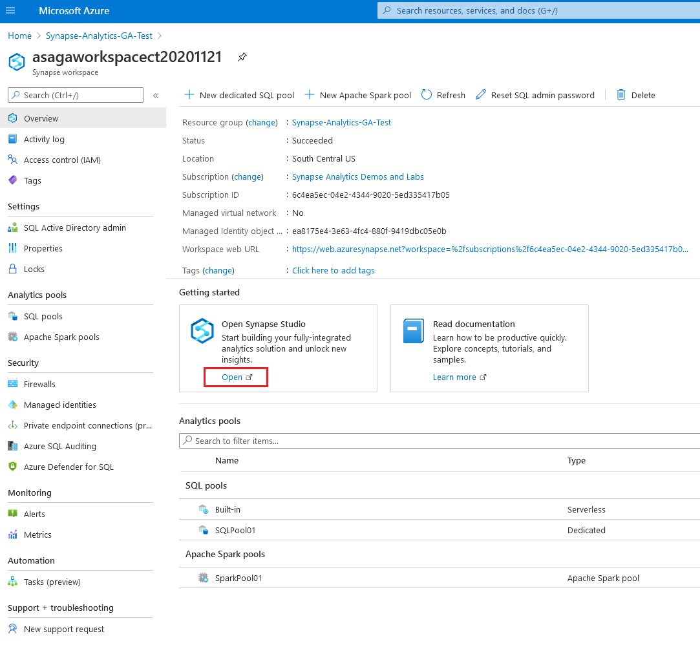

&nbsp;

* Press Manage in the left vertical toolbar

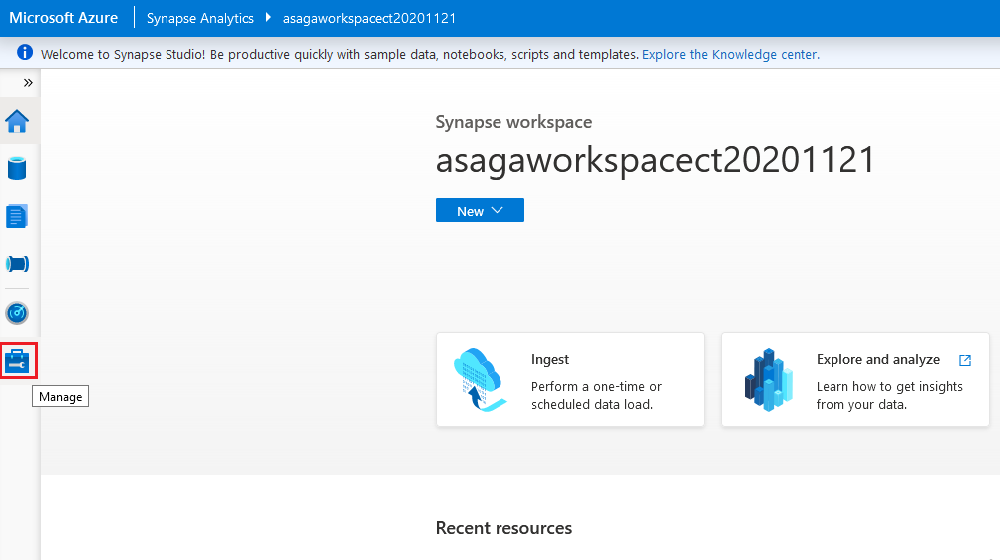

&nbsp;

* Press Linked Services in the left list then press New

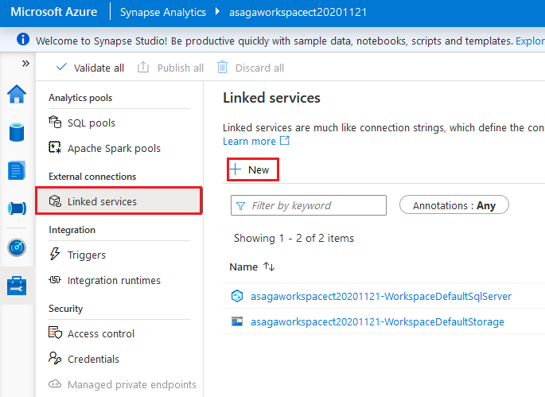

&nbsp;

* The New linked service list appears. Select Azure Data Explorer (Kusto) in the list and press Continue

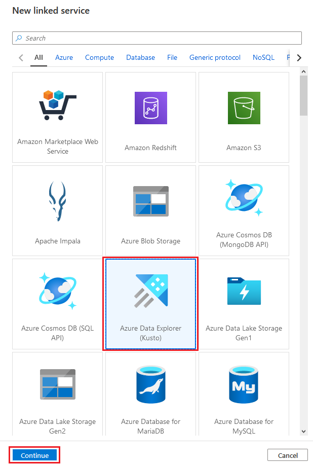

&nbsp;

* Configure the Linked Service: choose a Name, the Azure subscription.
Chose the ADE cluster you want to use. 
Enter the Service Principal ID of the Application you want to use.
As Service principal key use the secret you added to that Application.
Enter the name of the ADE database you want to access through this linked service.
To make sure the connection works you can press Test connection.
Once successfull, press Create to make the new linked service available.

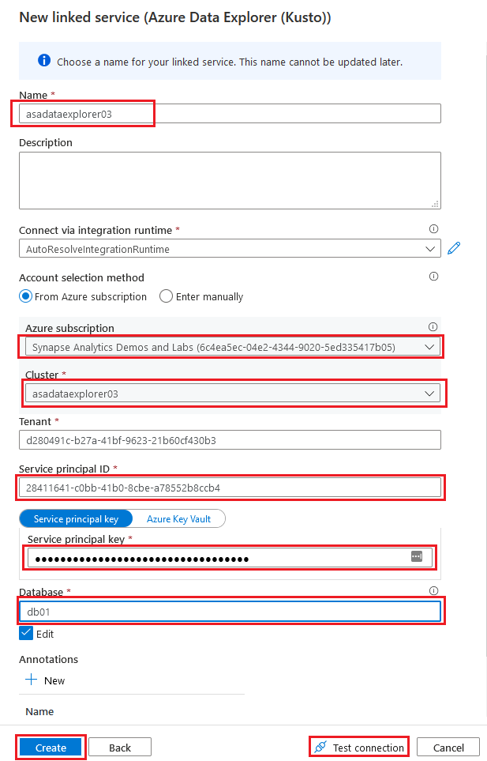

### Task 3 - Explore the Azure Data Explorer database in Synapse Studio

&nbsp;

* Open Azure Data Explorer Clusters, select your cluster in the left list


&nbsp;

* Click on the Databases item and choose your database

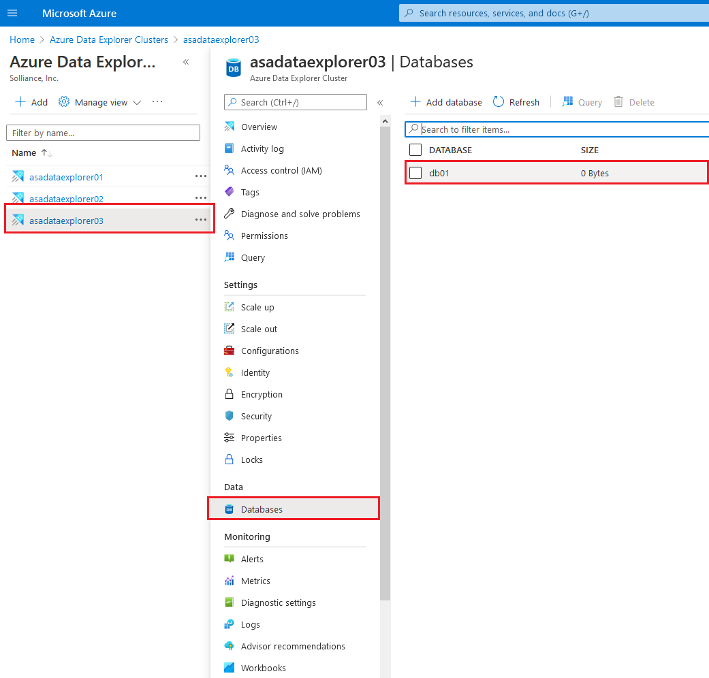

&nbsp;

* Click Query in the left list

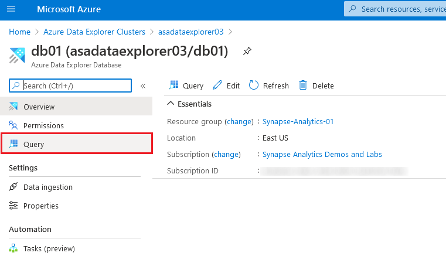

&nbsp;

* Select your database and then double click on the table name.
A default query is generate it. Click Run to execute it.
The results are available in the lower pane.

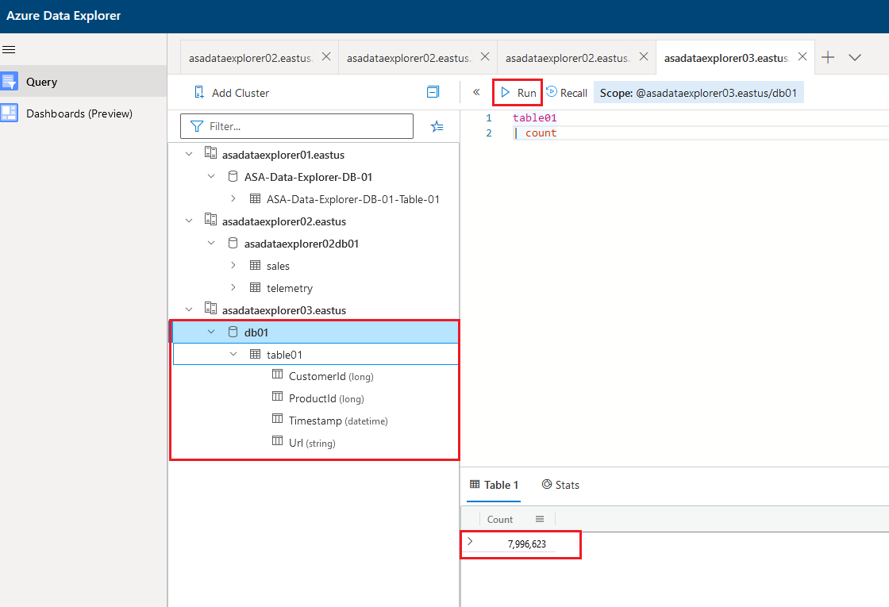


## Exercise 2 - Load and enrich data with Spark

We will use spark to handle our datasets coming from different datasources.

### Task 1 - Load data from Azure Data Explorer

```python
%%pyspark

# kusto connector 
# https://techcommunity.microsoft.com/t5/azure-data-explorer/announcing-azure-data-explorer-data-connector-for-azure-synapse/ba-p/1743868

# Read data from Azure Data Explorer table(s)
# Full Sample Code available at: https://github.com/Azure/azure-kusto-spark/blob/master/samples/src/main/python/SynapseSample.py
kustoDf  = spark.read \
    .format("com.microsoft.kusto.spark.synapse.datasource") \
    .option("spark.synapse.linkedService", "asadataexplorer01") \
    .option("kustoDatabase", "ASA-Data-Explorer-DB-01") \
    .option("kustoQuery", "ASA-Data-Explorer-DB-01-Table-01") \
    .load()

display(kustoDf)
```

### Task 2 - Index the Data Lake storage with Hyperspace

Hyperspace introduces the ability for Apache Spark users to create indexes on their datasets, such as CSV, JSON, and Parquet, and use them for potential query and workload acceleration.

Hyperspace lets you create indexes on records scanned from persisted data files. After they're successfully created, an entry that corresponds to the index is added to the Hyperspace's metadata. This metadata is later used by Apache Spark's optimizer (with our extensions) during query processing to find and use proper indexes.

If the underlying data changes, you can refresh an existing index to capture that.

Hyperspace allows users to compare their original plan versus the updated index-dependent plan before running their query

```scala
%%spark

//
// Hyperspace: An indexing subsystem for Apache Spark
//
// https://docs.microsoft.com/en-us/azure/synapse-analytics/spark/apache-spark-performance-hyperspace?pivots=programming-language-scala
//
// 1. Indices are persistent, only create them once
// 2. Only creating index over HDFS file based scan nodes is supported.
//

import com.microsoft.hyperspace._
import com.microsoft.hyperspace.index._

// Disable BroadcastHashJoin, so Spark will use standard SortMergeJoin. Currently, Hyperspace indexes utilize SortMergeJoin to speed up query.
spark.conf.set("spark.sql.autoBroadcastJoinThreshold", -1)

val dfSales = spark.read.parquet("abfss://wwi-02@asadatalake01.dfs.core.windows.net/sale-small/Year=2019/Quarter=Q4/Month=12/*/*.parquet")
dfSales.show(10)

val dfCustomers = spark.read.format("csv").option("header", "true").load("abfss://wwi-02@asadatalake01.dfs.core.windows.net/data-generators/generator-customer-clean.csv")
dfCustomers.show(10)

//Create an instance of Hyperspace
val hyperspace: Hyperspace = Hyperspace()

//create indices: each one contains a name, a set of indexed columns and a set of included columns
val indexConfigSales = IndexConfig("indexSALES", Seq("CustomerId"), Seq("TotalAmount"))
val indexConfigCustomers = IndexConfig("indexCUSTOMERS", Seq("CustomerId"), Seq("FullName"))


hyperspace.indexes.show
//hyperspace.deleteIndex("indexSALES")
//hyperspace.vacuumIndex("indexSALES")
//hyperspace.deleteIndex("indexCUSTOMERS")
//hyperspace.vacuumIndex("indexCUSTOMERS")
hyperspace.createIndex(dfSales, indexConfigSales)             //only create index once
hyperspace.createIndex(dfCustomers, indexConfigCustomers)     //only create index once
hyperspace.indexes.show

//Enable Hyperspace - Hyperspace optimization rules become visible to the Spark optimizer and exploit existing Hyperspace indexes to optimize user queries
spark.enableHyperspace

//If the original data on which an index was created changes, the index will no longer capture the latest state of data. You can refresh a stale index
//hyperspace.refreshIndex("indexSALES")
//hyperspace.refreshIndex("indexCUSTOMERS")

val df1 = dfSales.filter("""CustomerId = 203""").select("""TotalAmount""")
df1.show()
df1.explain(true)

val df2 = dfCustomers.filter("""CustomerId = 203""").select("""FullName""")
df2.show()
df2.explain(true)

val eqJoin = dfSales.join(dfCustomers, dfSales("CustomerId") === dfCustomers("CustomerId")).select(dfSales("TotalAmount"), dfCustomers("FullName"))
eqJoin.show()
eqJoin.explain(true)

//Plan with indexes versus... Plan without indexes
//we should see this in the plan: InMemoryFileIndex[abfss://datasets@hyperspacebenchmark.dfs.core.windows.net/hyperspaceon...
spark.conf.set("spark.hyperspace.explain.displayMode", "html")
hyperspace.explain(eqJoin)(displayHTML(_))

//Disable Hyperspace - Hyperspace rules no longer apply during query optimization. Disabling Hyperspace has no impact on created indexes because they remain intact
//spark.disableHyperspace
```

Same example as above, this time using Python code

```python
%%pyspark

#
# Hyperspace: An indexing subsystem for Apache Spark
#
# https://docs.microsoft.com/en-us/azure/synapse-analytics/spark/apache-spark-performance-hyperspace?pivots=programming-language-python
#
# 1. Indices are persistent, only create them once
# 2. Only creating index over HDFS file based scan nodes is supported.
#

from hyperspace import *  
from com.microsoft.hyperspace import *
from com.microsoft.hyperspace.index import *

# Disable BroadcastHashJoin, so Spark will use standard SortMergeJoin. Currently, Hyperspace indexes utilize SortMergeJoin to speed up query.
spark.conf.set("spark.sql.autoBroadcastJoinThreshold", -1)

dfSales = spark.read.parquet("abfss://wwi-02@asadatalake01.dfs.core.windows.net/sale-small/Year=2019/Quarter=Q4/Month=12/*/*.parquet")
dfSales.show(10)

dfCustomers = spark.read.load("abfss://wwi-02@asadatalake01.dfs.core.windows.net/data-generators/generator-customer-clean.csv", format="csv", header=True)
dfCustomers.show(10)

# Create an instance of Hyperspace
hyperspace = Hyperspace(spark)

#create indices: each one contains a name, a set of indexed columns and a set of included columns
indexConfigSales = IndexConfig("indexSALES", ["CustomerId"], ["TotalAmount"])
indexConfigCustomers = IndexConfig("indexCUSTOMERS", ["CustomerId"], ["FullName"])


#hyperspace.indexes().show()
#hyperspace.deleteIndex("indexSALES")
#hyperspace.vacuumIndex("indexSALES")
#hyperspace.deleteIndex("indexCUSTOMERS")
#hyperspace.vacuumIndex("indexCUSTOMERS")
hyperspace.createIndex(dfSales, indexConfigSales)			# only create index once
hyperspace.createIndex(dfCustomers, indexConfigCustomers)	# only create index once
hyperspace.indexes().show()

#Enable Hyperspace - Hyperspace optimization rules become visible to the Spark optimizer and exploit existing Hyperspace indexes to optimize user queries
Hyperspace.enable(spark)

#If the original data on which an index was created changes, the index will no longer capture the latest state of data. You can refresh a stale index
#hyperspace.refreshIndex("indexSALES")
#hyperspace.refreshIndex("indexCUSTOMERS")

df1 = dfSales.filter("""CustomerId = 203""").select("""TotalAmount""")
df1.show()
df1.explain(True)

df2 = dfCustomers.filter("""CustomerId = 203""").select("""FullName""")
df2.show()
df2.explain(True)

eqJoin = dfSales.join(dfCustomers, dfSales.CustomerId == dfCustomers.CustomerId).select(dfSales.TotalAmount, dfCustomers.FullName)
eqJoin.show()
eqJoin.explain(True)

#Plan with indexes versus... Plan without indexes
#we should see this in the plan: InMemoryFileIndex[abfss://datasets@hyperspacebenchmark.dfs.core.windows.net/hyperspaceon...
spark.conf.set("spark.hyperspace.explain.displayMode", "html")
hyperspace.explain(eqJoin, True, displayHTML)

#Disable Hyperspace - Hyperspace rules no longer apply during query optimization. Disabling Hyperspace has no impact on created indexes because they remain intact
#Hyperspace.disable(spark)
```

When running the spark queries with Hyperspace enabled and indices are present, the query plan shows that the Hyperspace indices are being used.


### Task 3 - Explore the Data Lake storage with the MSSparkUtil library

Microsoft Spark Utilities (MSSparkUtils) is a builtin package to help you easily perform common tasks. You can use MSSparkUtils to work with file systems, to get environment variables, and to work with secrets.

```python
%%pyspark

from notebookutils import mssparkutils

#
# Microsoft Spark Utilities
#
# https://docs.microsoft.com/en-us/azure/synapse-analytics/spark/microsoft-spark-utilities?pivots=programming-language-python
#

# Azure storage access info
blob_account_name = 'asadatalake01'
blob_container_name = 'wwi-02'
blob_relative_path = '/'
linkedServiceName = 'asadatalake01'
blob_sas_token = mssparkutils.credentials.getConnectionStringOrCreds(linkedServiceName)

# Allow SPARK to access from Blob remotely
spark.conf.set('fs.azure.sas.%s.%s.blob.core.windows.net' % (blob_container_name, blob_account_name), blob_sas_token)

files = mssparkutils.fs.ls('/')
for file in files:
    print(file.name, file.isDir, file.isFile, file.path, file.size)

mssparkutils.fs.mkdirs('NewFolder')

files = mssparkutils.fs.ls('/')
for file in files:
    print(file.name, file.isDir, file.isFile, file.path, file.size)
```

### Task 4 - Load data from Data Lake storage

Use spark to read parquet files from DataLake

```python
%%pyspark
#load parquet as a spark dataframe
dfSales = spark.read.parquet('abfss://wwi-02@asadatalake01.dfs.core.windows.net/sale-small/Year=2019/Quarter=Q4/Month=12/*/*.parquet')
dfSales.printSchema()
dfSales.show(10)
```

### Task 5 - Load data from SQL Pool

Use spark to read SQLDB contents via the `sqlanalytics` connector. Only Scala is supported.

```scala
%%spark

import com.microsoft.spark.sqlanalytics.utils.Constants
import org.apache.spark.sql.SqlAnalyticsConnector._

//read from SQLDB
val dfInput3 = spark.read.sqlanalytics("SQLPool02.wwi.Product") 
dfInput3.head(10)
```

### Task 6 - Enrich data from multiple sources

Using Spark we can perform powerful queries on all our data.

```python
%%pyspark

from pyspark.sql.window import Window
import _datetime

#read sales from datalake
#TransactionId,CustomerId,ProductId,Quantity,Price,TotalAmount,TransactionDate,ProfitAmount,Hour,Minute,StoreId
val dfSales = spark.read.parquet("abfss://wwi-02@asadatalake01.dfs.core.windows.net/sale-small/Year=2019/Quarter=Q4/Month=12/*/*.parquet")

#read products from sqldb
val dfProducts = spark.read.sqlanalytics("SQLPool02.wwi.Product") 
#val dfCustomers = spark.read.sqlanalytics("SQLPool02.wwi.Customers") 

#read telemetry from ade/kusto
#CustomerId,ProductId,Timestamp,Url
dfTelemetry  = spark.read \
    .format("com.microsoft.kusto.spark.synapse.datasource") \
    .option("spark.synapse.linkedService", "asadataexplorer01") \
    .option("kustoDatabase", "ASA-Data-Explorer-DB-01") \
    .option("kustoQuery", "ASA-Data-Explorer-DB-01-Table-01") \
    .load()


#link sales with product details
#df1 = dfSales.join(dfProducts, dfSales.name == dfProducts.name)
#df2 = dfTelemetry.join(df1, (dfTelemetry.ProductId == df1.ProductId) & (dfTelemetry.CustomerId == df1.CustomerId))

#add new column to transactions to have the full timestamp
def getTransactionTimestamp(dt, hh, mm):
    dt = _datetime.datetime.strptime(dt, "%Y%m%d")
    return _datetime.datetime(dt.year, dt.month, dt.day, hh, mm, 0, 0)
func1 = udf(lambda dt,hh,mm: getTransactionTimestamp(dt,hh,mm), TimestampType())
val dfTrans = dfSales.withColumn("TransactionTimestamp", func1(dfSales.TransactionDate, dfSales.Hour, dfSales.Minute))


#match transactions with telemetry entries
#a telemetry entry belongs to a transaction if it was logged during the 15 minutes before the transaction
def isWithinTransTimeFrame(tsTelem, tsTrans):
    deltaSec = (tsTrans-tsTelem).total_seconds()
    return 0 < deltaSec and deltaSec < 900
func2 = udf(lambda x, y: isWithinTransTimeFrame(x, y), BooleanType())
df = dfTelemetry.crossJoin(dfTrans).where(func2(dfTelemetry.Timestamp, dfTrans.TransactionTimestamp))

#for each TransactionTimestamp we get a window frame / partition sorted by telemetry Timestamps
windowSpec = Window.partitionBy(df['TransactionTimestamp']).orderBy(df['Timestamp'].desc())

#compute the time-to-trans and clicks-to-trans
dfClicks = df.withColumn("ClicksToPurchase", count("Timestamp").over(windowSpec))
dfTime = df.withColumn("TimeToPurchase", min("Timestamp").over(windowSpec))
```

## Exercise 3 - Publish and consume enriched data

The output data will be now persisted in order to be used for further analysis.

### Task 1 - Save enriched data to Data Lake storage

Use spark to write dataframe to DataLake:

```python
%%pyspark

#write to datalake
df \
 .coalesce(1) \
 .write \
 .mode("overwrite") \
 .option("header", "true") \
 .format("com.databricks.spark.csv") \
 .save('abfss://wwi-02@asadatalake01.dfs.core.windows.net/output')
```

### Task 2 - Access data with the SQL built-in pool


We can create shared database/table metadata (between its serverless Apache Spark pools and serverless SQL pool)

```python
%%pyspark

#
# create an external/unmanaged database/table from datalake information
#
# see https://docs.microsoft.com/en-us/azure/synapse-analytics/metadata/overview
#
spark.sql("CREATE DATABASE IF NOT EXISTS ASA_SPARK_DB01")
spark.sql("CREATE TABLE IF NOT EXISTS ASA_SPARK_DB01.salesmall201912 USING Parquet LOCATION 'abfss://wwi-02@asadatalake01.dfs.core.windows.net/sale-small/Year=2019/Quarter=Q4/Month=12/*/*.parquet'")

#since we now have table metadata, we can now use SQL queries (with or without spark)
dfExt = spark.sql("SELECT * FROM asa_spark_db01.salesmall201912")
dfExt.show(10)
```

### Task 3 - Display enriched data in Power BI

TODO

## After the hands-on lab

Follow the instructions in [Clean-up your subscription](./../setup/cleanup.md) to clean-up your environment after the hands-on lab.

## Resources

To learn more about the topics covered in this lab, use these resources:

- [Apache Spark in Azure Synapse Analytics](https://docs.microsoft.com/en-us/azure/synapse-analytics/spark/apache-spark-overview)
- [Announcing Azure Data Explorer data connector for Azure Synapse](https://techcommunity.microsoft.com/t5/azure-data-explorer/announcing-azure-data-explorer-data-connector-for-azure-synapse/ba-p/1743868)
- [Connect to Azure Data Explorer using Apache Spark for Azure Synapse Analytics](https://docs.microsoft.com/en-us/azure/synapse-analytics/quickstart-connect-azure-data-explorer)
- [Azure Synapse Analytics shared metadata](https://docs.microsoft.com/en-us/azure/synapse-analytics/metadata/overview)
- [Introduction of Microsoft Spark Utilities](https://docs.microsoft.com/en-us/azure/synapse-analytics/spark/microsoft-spark-utilities?pivots=programming-language-python)
- [Hyperspace - An open source indexing subsystem that brings index-based query acceleration to Apache Spark™ and big data workloads](https://github.com/microsoft/hyperspace)