# Lab 02 - Working with Apache Spark in Synapse Analytics

This lab demonstrates the experience of working with Apache Spark in Azure Synapse Analytics. You will learn how to connect an Azure Synapse Analytics workspace to an Azure Data Explorer workspace using a Linked Service and then load data from one of its databases using a Spark notebook. You will also learn how to use libraries like Hyperspace and MSSparkUtil to optimize the experience of working with Data Lake storage accounts from Spark notebooks. In addition to Data Explorer and Data Lake storage, the data enrichment process will also use historical data from a SQL Pool. In the end, you will learn how to publish the enriched data back into the Data Lake and consume it with the SQL Built-in Pool and Power BI.

After completing the lab, you will understand the main steps of an end-to-end data enrichment process that uses Spark in an Azure Synapse Analytics workspace.

This lab has the following structure:

- [Before the hands-on lab](#before-the-hands-on-lab)
  - [Task 1 - Create and configure the Azure Synapse Analytics workspace](#task-1---create-and-configure-the-azure-synapse-analytics-workspace)
  - [Task 2 - Create and configure additional resources for this lab](#task-2---create-and-configure-additional-resources-for-this-lab)
- [Exercise 1 - Configure an Azure Data Explorer linked service](#exercise-1---configure-an-azure-data-explorer-linked-service)
  - [Task 1 - Create the linked service](#task-1---create-the-linked-service)
  - [Task 2 - Explore the Azure Data Explorer database in Synapse Studio](#task-2---explore-the-azure-data-explorer-database-in-synapse-studio)
- [Exercise 2 - Load and enrich data with Spark](#exercise-2---load-and-enrich-data-with-spark)
  - [Task 1 - Load data from Azure Data Explorer](#task-1---load-data-from-azure-data-explorer)
  - [Task 2 - Index the Data Lake storage with Hyperspace](#task-2---index-the-data-lake-storage-with-hyperspace)
  - [Task 3 - Explore the Data Lake storage with the MSSparkUtil library](#task-3---explore-the-data-lake-storage-with-the-mssparkutil-library)
  - [Task 4 - Load data from Data Lake storage](#task-4---load-data-from-data-lake-storage)
  - [Task 5 - Load data from SQL Pool](#task-5---load-data-from-sql-pool)
  - [Task 6 - Enrich data from multiple sources](#task-6---enrich-data-from-multiple-sources)
- [Exercise 3 - Consume enriched data](#exercise-3---consume-enriched-data)
  - [Task 1 - Access data with the SQL built-in pool](#task-1---access-data-with-the-sql-built-in-pool)
  - [Task 2 - Display enriched data in Power BI](#task-2---display-enriched-data-in-power-bi)
- [After the hands-on lab](#after-the-hands-on-lab)
- [Resources](#resources)

## Before the hands-on lab

Before stepping through the exercises in this lab, make sure you have properly configured your Azure Synapse Analytics workspace. Perform the tasks below to configure the workspace.

### Task 1 - Create and configure the Azure Synapse Analytics workspace

>**NOTE**
>
>If you have already created and configured the Synapse Analytics workspace while running one of the other labs available in this repo, you must not perform this task again and you can move on to the next task. The labs are designed to share the Synapse Analytics workspace, so you only need to create it once.

Follow the instructions in [Deploy your Azure Synapse Analytics workspace](./../setup/asa-workspace-deploy.md) to create and configure the workspace.

### Task 2 - Create and configure additional resources for this lab

Follow the instructions in [Deploy resources for Lab 02](./../setup/lab-02-deploy.md) to deploy additional resources for this lab. Once deployment is complete, you are ready to proceed with the exercises in this lab.

## Exercise 1 - Configure an Azure Data Explorer linked service

In this exercise, you will link your Synapse Analytics with an instance of Azure Data Explorer. This will allow you to explore Azure Data Explorer databases from Synapse Studio and use the Azure Data Explorer datasource in Spark queries.

### Task 1 - Create the linked service

The Synapse Analytics linked service authenticates with Azure Data Explorer using a service principal. The service principal is based on an Azure Active Directory application named `Azure Synapse Analytics GA Labs` and has already been created for you by the deployment procedure. The secret associated with the service principal has also been created and saved in the Azure Key Vault instance, under the `ASA-GA-LABS` name.

>**NOTE**
>
>In the labs provided by this repo, the Azure AD application is used in a single Azure AD tenant which means it has exactly one service principal associated to it. Consequently, we will use the terms Azure AD application and service principal interchangeably. For a detailed explanation on Azure AD applications and security principals, see [Application and service principal objects in Azure Active Directory](https://docs.microsoft.com/en-us/azure/active-directory/develop/app-objects-and-service-principals).

To view the service principal, open the Azure portal and navigate to your instance of Azure Active directory. Select the `App registrations` section and you should see the `Azure Synapse Analytics GA Labs` application under the `Owned applications` tab.

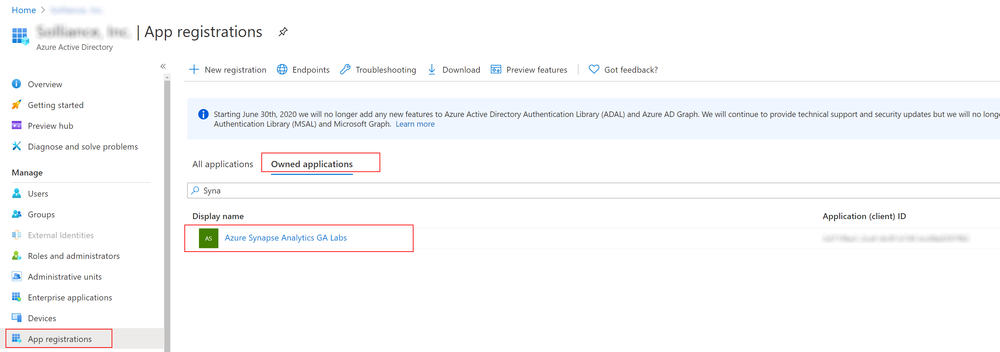

Select the application to view its properties and copy the value of the `Application (client) ID` property (you will need it in a moment to configure the linked service).


To view the secret, open the Azure Portal and navigate to the Azure Key Vault instance that has been created in your resource group. Select the `Secrets` section and you should see the `ASA-GA-LABS` secret:


First, you need to make sure the service principal has permissions to work with the Azure Data Explorer cluster and database. The setup procedure has already configured the necessary permissions, so you will just inspect them to make sure everything is in place.

Open the Azure Portal and navigate to the Azure Data Explorer cluster that has been created in your resource group. Select the `Databases` section on the left, then select the `ASA-Data-Explorer-DB-01` from the list of databases, and then select the `Permissions` section on the left. You should see the `Azure Synapse Analytica GA Labs` application listed under the `Database Admin` role.

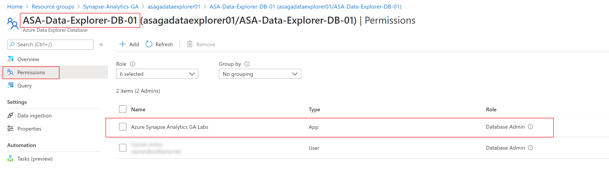

You are now ready to create the Azure Data Explorer linked service.

To create a new linked service, open Synapse Studio, select the `Manage` hub, select `Linked services`, and the select `+ New`. In the search field from the `New linked service` dialog, enter `Azure Machine Learning`. Select the `Azure Machine Learning` option and then select `Continue`.

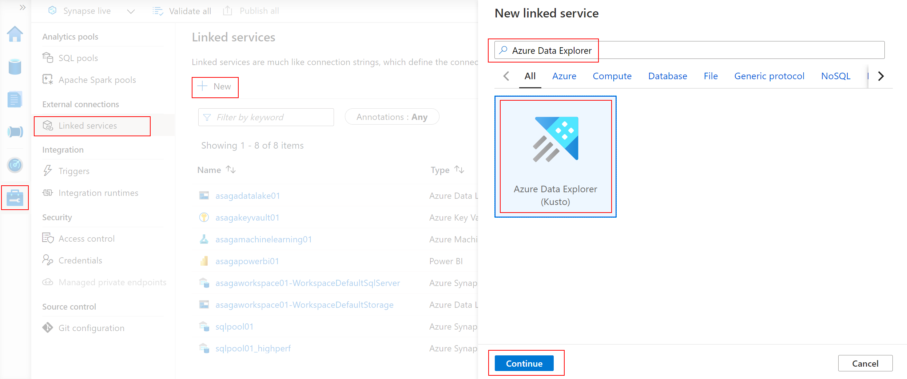

In the `New linked service (Azure Data Explorer (Kusto))` dialog, provide the following properties:

- **Name**: enter `asagadataexplorer01`.
- **Azure subscription**: make sure the Azure subscription containing your resource group is selected.
- **Cluster**: make sure your Azure Data Explorer cluster is selected.
- **Tenant**: notice how `Tenant identifier` has been already filled in for you.
- **Service principal ID**: enter the application client ID that you copied earlier.
- Select the `Azure Key Vault` option.
- **AKV linked service**: make sure your Azure Key Vault service is selected.
- **Secret name**: enter `ASA-GA-LABS`.
- **Database**: enter `ASA-Data-Explorer-DB-01`.

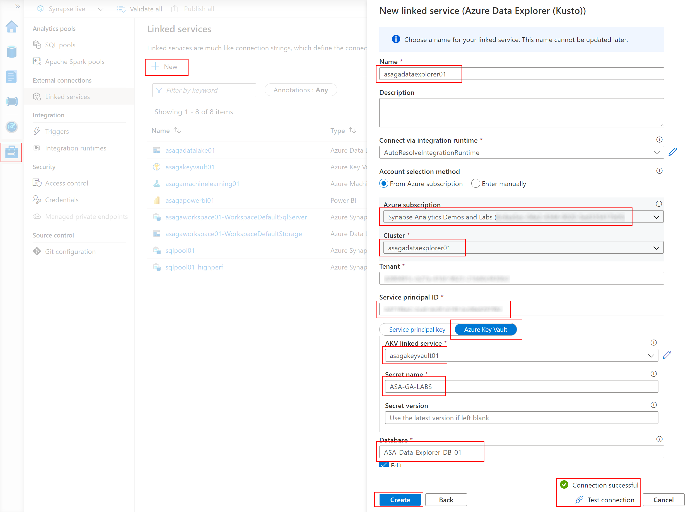

Next, select `Test connection` to make sure all settings are correct, and then select `Create`. The Azure Machine Learning linked service will now be created in the Synapse Analytics workspace.

>**IMPORTANT**
>
>The linked service is not complete until you publish it to the workspace. Notice the indicator near your Azure Machine Learning linked service. To publish it, select `Publish all` and then `Publish`.


### Task 2 - Explore the Azure Data Explorer database in Synapse Studio

Once the linked service is published, you can view the Azure Data Explorer databases and tables in Synapse Studio. Select the `Data` hub on the left site, then select the `Linked` section and the expand the `Azure Data Explorer` section to view the databases and tables under it. Activate the context menu next to the `SalesTelemetry` table by clicking on the `...` indicator (appears when you hover over the table name) and then select `New notebook > Read DataFrame from table`.

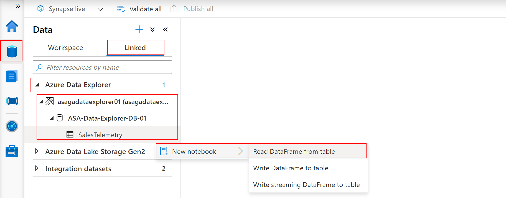

The notebook that is created for your shows how to load a Spark DataFrame from the `SalesTelemetry` table. Take a moment to observe the generated code, then select the `SparkPool01` Spark pool to attach to and run the cell. You will get the first 10 records from the table.

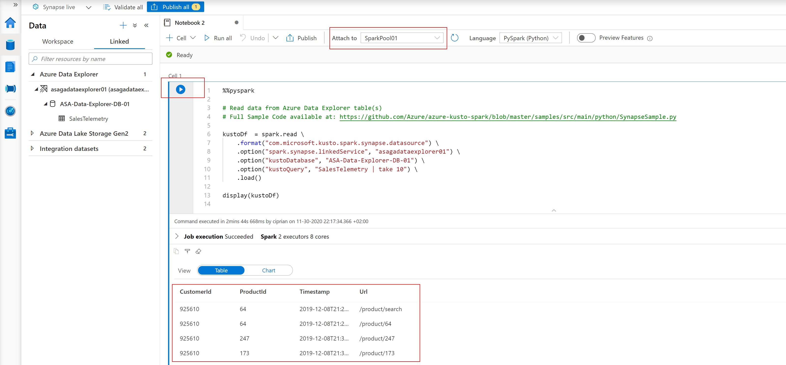

## Exercise 2 - Load and enrich data with Spark

In this exercise you will load data into Spark DataFrames from multiple sources and then perform enrichment steps to consolidate and correlate that data. In the process, you will explore the use of the `Hyperspace` indexing engine and of the `MSSparkUtil` library.

### Task 1 - Load data from Azure Data Explorer

To load all the data stored in the Data Explorer table, remove the `| take 10` part from line 10 and change line 13 into

```python
kustoDf.count()
```

Run the cell again. This time, the execution should take longer as the DataFrame is fully loaded with the content of the Data Explorer table. The loaded DataFrame contains 12.79 million records.

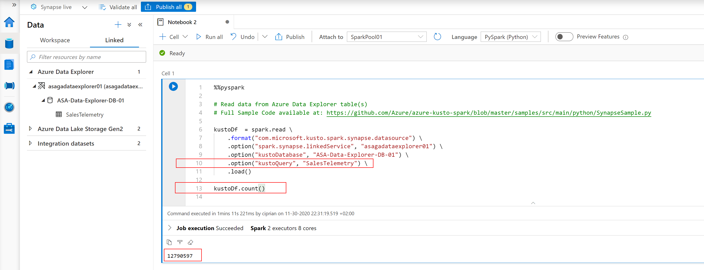

### Task 2 - Index the Data Lake storage with Hyperspace

When loading data from Azure Data Lake Gen 2, searching in the data in one of the most resource consuming operations. [Hyperspace](https://github.com/microsoft/hyperspace) introduces the ability for Apache Spark users to create indexes on their datasets, such as CSV, JSON, and Parquet, and use them for potential query and workload acceleration.

Hyperspace lets you create indexes on records scanned from persisted data files. After they're successfully created, an entry that corresponds to the index is added to the Hyperspace's metadata. This metadata is later used by Apache Spark's optimizer during query processing to find and use proper indexes. If the underlying data changes, you can refresh an existing index to capture that.

Also, Hyperspace allows users to compare their original plan versus the updated index-dependent plan before running their query.

Add a new cell to your notebook with the following code (remember to replace `<unique_suffix>` with the value you specified during the Synapse Analytics workspace deployment):

```python
from hyperspace import *  
from com.microsoft.hyperspace import *
from com.microsoft.hyperspace.index import *

# Disable BroadcastHashJoin, so Spark will use standard SortMergeJoin. Currently, Hyperspace indexes utilize SortMergeJoin to speed up query.
spark.conf.set("spark.sql.autoBroadcastJoinThreshold", -1)

dfSales = spark.read.parquet("abfss://wwi-02@asagadatalake<unique_suffix>.dfs.core.windows.net/sale-small/Year=2019/Quarter=Q4/Month=12/*/*.parquet")
dfSales.show(10)

dfCustomers = spark.read.load("abfss://wwi-02@asagadatalake<unique_suffix>.dfs.core.windows.net/data-generators/generator-customer-clean.csv", format="csv", header=True)
dfCustomers.show(10)

# Create an instance of Hyperspace
hyperspace = Hyperspace(spark)
```

Run the new cell. It will load the two DataFrames with data from the data lake and initalize Hyperspace.

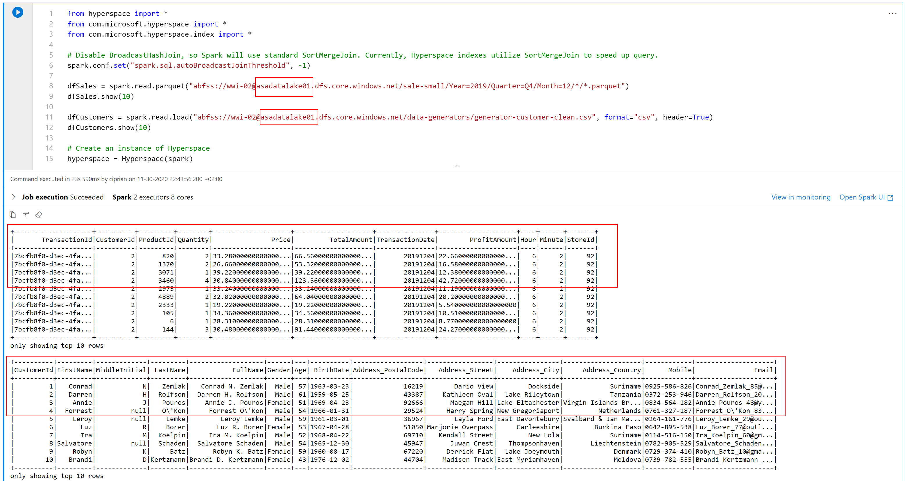

Add another new cell to your notebook with the following code:

```python
#create indexes: each one contains a name, a set of indexed columns and a set of included columns
indexConfigSales = IndexConfig("indexSALES", ["CustomerId"], ["TotalAmount"])
indexConfigCustomers = IndexConfig("indexCUSTOMERS", ["CustomerId"], ["FullName"])

hyperspace.createIndex(dfSales, indexConfigSales)			# only create index once
hyperspace.createIndex(dfCustomers, indexConfigCustomers)	# only create index once
hyperspace.indexes().show()
```

Run the new cell. It will create two indexes and display their structure.

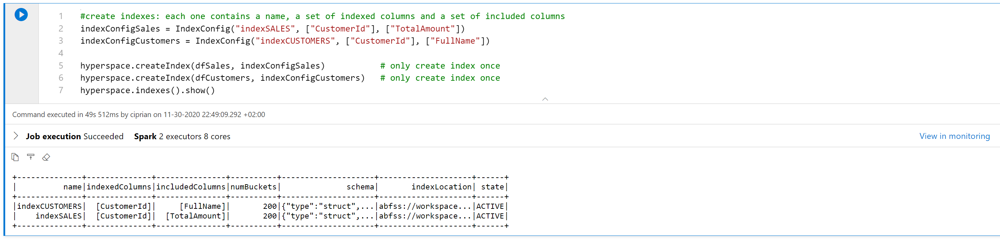

Add another new cell to your notebook with the following code:

```python
df1 = dfSales.filter("""CustomerId = 203""").select("""TotalAmount""")
df1.show()
df1.explain(True)
```

Run the new cell. The output will show that the physical execution plan is not taking into account any of the indexes (performs a file scan on the original data file).

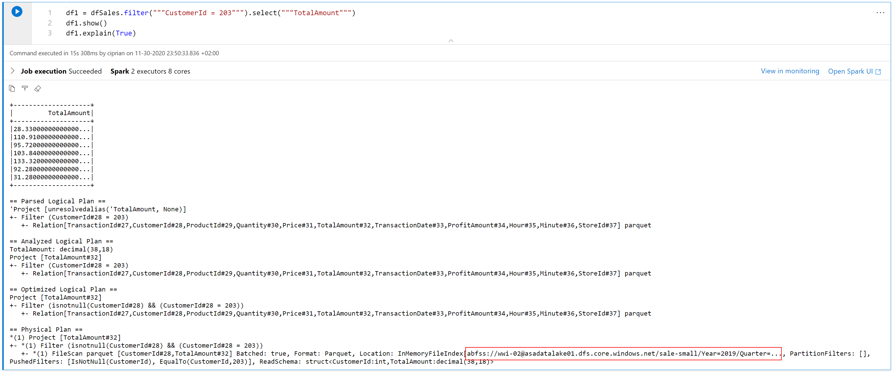

Now add another new cell to your notebook with the following code (notice the extra line at the beginning used to enable Hyperspace optimization in the Spark engine):

```python
# Enable Hyperspace - Hyperspace optimization rules become visible to the Spark optimizer and exploit existing Hyperspace indexes to optimize user queries
Hyperspace.enable(spark)
df1 = dfSales.filter("""CustomerId = 203""").select("""TotalAmount""")
df1.show()
df1.explain(True)
```

Run the new cell. The output will show that the physical execution plan is now using the index instead of the orginal data file.

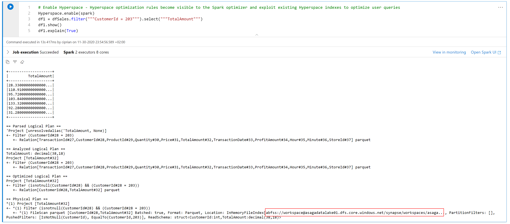

Hyperspace provides an Explain API that allows you to compare the execution plans without indexes vs. with indexes. Add a new cell with the following code:

```python
df1 = dfSales.filter("""CustomerId = 203""").select("""TotalAmount""")

spark.conf.set("spark.hyperspace.explain.displayMode", "html")
hyperspace.explain(df1, True, displayHTML)
```

Run the new cell. The output shows a comparison `Plan with indexes` vs. `Plan without indexes`. Observe how, in the first case the index file is used while in the second case the original data file is used.

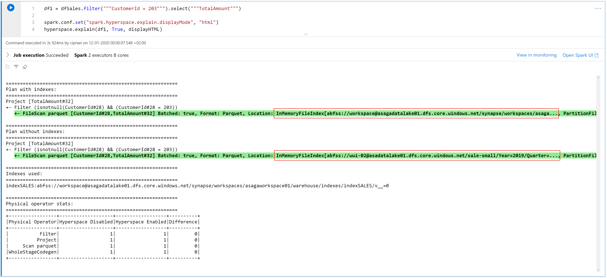

Let's investigate now a more complex case, involving a join operation. Add a new cell with the following code:

```python
eqJoin = dfSales.join(dfCustomers, dfSales.CustomerId == dfCustomers.CustomerId).select(dfSales.TotalAmount, dfCustomers.FullName)

hyperspace.explain(eqJoin, True, displayHTML)
```

Run the new cell. The output shows again a comparison `Plan with indexes` vs. `Plan without indexes`, where indexes are used in the first case and the original data files in the second.

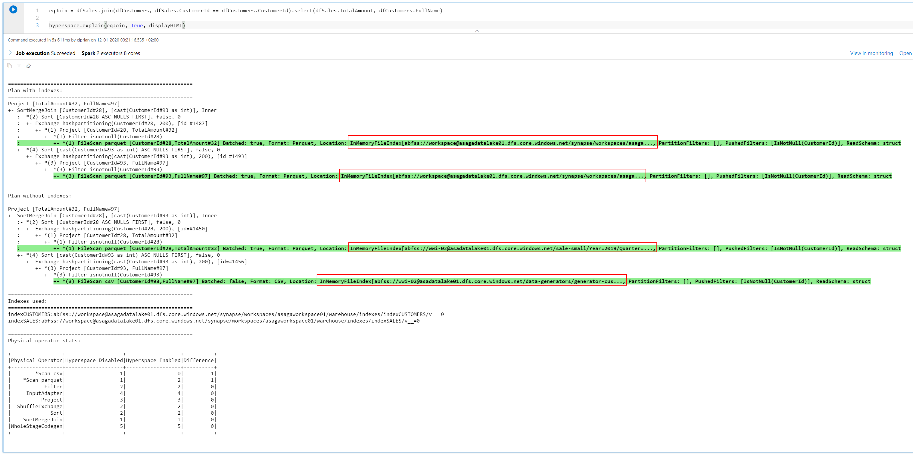

In case you want to deactivate Hyperspace and cleanup the indexes, you can run the following code:

```python
# Disable Hyperspace - Hyperspace rules no longer apply during query optimization. Disabling Hyperspace has no impact on created indexes because they remain intact
Hyperspace.disable(spark)

hyperspace.deleteIndex("indexSALES")
hyperspace.vacuumIndex("indexSALES")
hyperspace.deleteIndex("indexCUSTOMERS")
hyperspace.vacuumIndex("indexCUSTOMERS")
```

### Task 3 - Explore the Data Lake storage with the MSSparkUtil library

Microsoft Spark Utilities (MSSparkUtils) is a builtin package to help you easily perform common tasks. You can use MSSparkUtils to work with file systems, to get environment variables, and to work with secrets.

Continue with the same notebook from the previous task and add a new cell with the following code (remember to replace `<unique_suffix>` with the value you specified during the Synapse Analytics workspace deployment):

```python
from notebookutils import mssparkutils

#
# Microsoft Spark Utilities
#
# https://docs.microsoft.com/en-us/azure/synapse-analytics/spark/microsoft-spark-utilities?pivots=programming-language-python
#

# Azure storage access info
blob_account_name = 'asagadatalake<unique_suffix>'
blob_container_name = 'wwi-02'
blob_relative_path = '/'
linkedServiceName = 'asagadatalake<unique_suffix>'
blob_sas_token = mssparkutils.credentials.getConnectionStringOrCreds(linkedServiceName)

# Allow SPARK to access from Blob remotely
spark.conf.set('fs.azure.sas.%s.%s.blob.core.windows.net' % (blob_container_name, blob_account_name), blob_sas_token)

files = mssparkutils.fs.ls('/')
for file in files:
    print(file.name, file.isDir, file.isFile, file.path, file.size)

mssparkutils.fs.mkdirs('/SomeNewFolder')

files = mssparkutils.fs.ls('/')
for file in files:
    print(file.name, file.isDir, file.isFile, file.path, file.size)
```

Run the new cell and observe how `mssparkutils` is used to work with the file system.

### Task 4 - Load data from Data Lake storage

In Task 2, you have already loaded data into the notebook from the Data Lake storage. Here is the code snipped that loads a Spark DataFrame from the Data Lake (in case you want to run this, remember to replace `<unique_suffix>` with the value you specified during the Synapse Analytics workspace deployment):

```python
# load parquet as a spark dataframe
dfSales = spark.read.parquet('abfss://wwi-02@asagadatalake<unique_suffix>.dfs.core.windows.net/sale-small/Year=2019/Quarter=Q4/Month=12/*/*.parquet')
dfSales.printSchema()
dfSales.show(10)
```

### Task 5 - Load data from SQL Pool

The Azure Synapse Apache Spark to Synapse SQL connector (`sqlanalytics`) is designed to efficiently transfer data between serverless Apache Spark pools and SQL pools in Azure Synapse. The Azure Synapse Apache Spark to Synapse SQL connector works on dedicated SQL pools only, it doesn't work with serverless SQL pool. The connector works only in Scala currently.

Continue with the same notebook from the previous task and add a new cell with the following code:

```scala
%%spark

import com.microsoft.spark.sqlanalytics.utils.Constants
import org.apache.spark.sql.SqlAnalyticsConnector._

// read from SQL pool
val dfProducts = spark.read.sqlanalytics("SQLPool01.wwi.Product")
dfProducts.head(10)
```

Run the new cell and observe the results loaded into the Spark DataFrame. To learn more about the `sqlanalytics` connector read the [Ingest and prepare data - Introduction](https://docs.microsoft.com/en-us/azure/synapse-analytics/spark/synapse-spark-sql-pool-import-export) section in the Synapse Analytics Apache Spark documentation.

### Task 6 - Enrich data from multiple sources

You are now familiar with the details of loading data into Spark DataFrames from several sources:

- Azure Data Explorer
- Azure Data Lake Gen 2
- Azyre Synapse Analytics SQL pool

In this task you will peform a complex data enrichment taks involving all of the three sources.

Continue with the same notebook from the previous task and add a new cell with the following code:

```scala
%%spark

import com.microsoft.spark.sqlanalytics.utils.Constants
import org.apache.spark.sql.SqlAnalyticsConnector._

// read from SQL pool
val dfProduct = spark.read.sqlanalytics("SQLPool01.wwi.Product")
val dfCustomer = spark.read.sqlanalytics("SQLPool01.wwi.Customer")

dfProduct.createOrReplaceTempView("Product")
dfCustomer.createOrReplaceTempView("Customer")
```

Run the new cell. It will read data from the `Product` and `Customer` tables from the SQL pool.

Add a new cell with the following code:

```python
prod_df = spark.sql("SELECT * FROM Product")
prod_df.cache()

cust_df = spark.sql("SELECT CustomerId, Age from Customer")
cust_df.cache()
```

Run the new cell. It will load the product and customer data into Spark DataFrames in PySpark.

Add a new cell with the following code (remember to replace `<unique_suffix>` in line 14 with the value you specified during the Synapse Analytics workspace deployment):

```python
import datetime

from pyspark.sql.functions import udf, col
from pyspark.sql.types import TimestampType

timeUDF = udf(lambda tran_date, hour, minute:to_datetime(tran_date, hour, minute), TimestampType())

def to_datetime(tranDate, hour, minute):
    year = tranDate // 10000
    month = (tranDate - year * 10000) // 100
    day = tranDate - year * 10000 - month * 100
    return datetime.datetime(year, month, day, hour, minute, 0)

sales_df = spark.read.parquet("abfss://wwi-02@asagadatalake<unique_suffix>.dfs.core.windows.net/sale-small/Year=2019/Quarter=Q4/Month=12/Day=20191201/*.parquet")

sales_df = sales_df.withColumn("TransactionTime", timeUDF(sales_df.TransactionDate, sales_df.Hour, sales_df.Minute))
display(sales_df.take(10))
```

Run the new cell. It will load sales data for December 1st, 2019 from the Data Lake.

Add a new cell with the following code:

```python
telemetry_df  = spark.read \
    .format("com.microsoft.kusto.spark.synapse.datasource") \
    .option("spark.synapse.linkedService", "asagadataexplorer01") \
    .option("kustoDatabase", "ASA-Data-Explorer-DB-01") \
    .option("kustoQuery", "SalesTelemetry | where Timestamp >= datetime(2019-12-01) and Timestamp < datetime(2019-12-02)") \
    .load()

display(telemetry_df.take(10))
```

Run the new cell. It will load online telemetry data for December 1st, 2019, from the Data Explorer database.

Add a new cell with the following code:

```python
df = telemetry_df.join(sales_df, on=['CustomerId', 'ProductId'], how='inner') \
    .withColumn('TimeDelta', col('TransactionTime').cast('long') - col('Timestamp').cast('long')) \
    .where((col('TimeDelta') > 0) & (col('TimeDelta') < 900)) \
    .groupBy('CustomerId', 'TransactionId', 'TransactionTime') \
    .agg(
        f.count('Timestamp').alias('TotalClicksToPurchase'),
        f.min('Timestamp').alias('TransactionStartTime')) \
    .withColumn('TotalSecondsToPurchase', col('TransactionTime').cast('long') - col('TransactionStartTime').cast('long')) \
    .drop('TransactionStartTime') \
    .join(cust_df, on=['CustomerId'], how='inner')

display(df.take(10))
```

Run the cell. It will perform the following tasks:

- Join telemetry data with sales data and apply the following fuzzy matching rule: if the telemetry entry refers to the same customer and product, and occurs at most 900 seconds before the sales transaction, it is considered to refer to that transaction.
- Calculate the number of telemetry entries per transaction (`TotalClicksToPurchase` - each telemetry entry is considered to be the equivalent of one click on the web site) and the total time to make the purchase (`TotalSecondsToPurchase` - number of seconds between the timestamp of the earliest associated telemetry entry and the transaction timestamp).
- Join with customer data, to get customer age information.

Finally, add a new cell with the following code (remember to replace `<unique_suffix>` in line 1 with the value you specified during the Synapse Analytics workspace deployment):

```python
df.coalesce(1).write.parquet("abfss://wwi-02@asagadatalake<unique_suffix>.dfs.core.windows.net/sale-small-stats")
```

Run the cell. It will save the enriched dataset to the Data Lake, under the `sale-small-stats` folder.

## Exercise 3 - Consume enriched data

In this exercise, you will view the information in the enriched dataset in a Power BI report.

### Task 1 - Access data with the SQL built-in pool

In Synapse Studio, select the `Data` hub on the left side, select the `Linked` section, and then select the primary data lake account under `Azure Data Lake Storage Gen 2`. Next, select the `wwi-02` file system, select the `sale-small-stats` folder, and then select `New SQL script > Select TOP 100 rows` from the context menu available by right-clicking on the Parquet file.

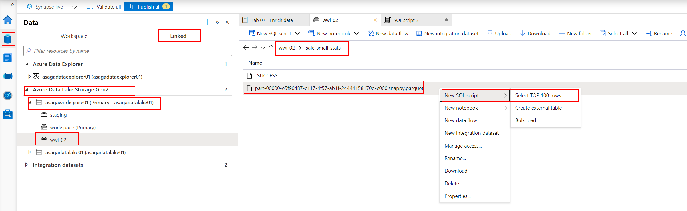

Change the T-SQL script to the following (remember to replace `<unique_suffix>` in line 1 with the value you specified during the Synapse Analytics workspace deployment):

```sql
SELECT
    TOP 100 *
FROM
    OPENROWSET(
        BULK 'https://asagadatalake<unique_suffix>.dfs.core.windows.net/wwi-02/sale-small-stats/*.parquet',
        FORMAT='PARQUET'
    ) AS [result]
```

Run the query on the `Built-in` serverless pool and observe the results.

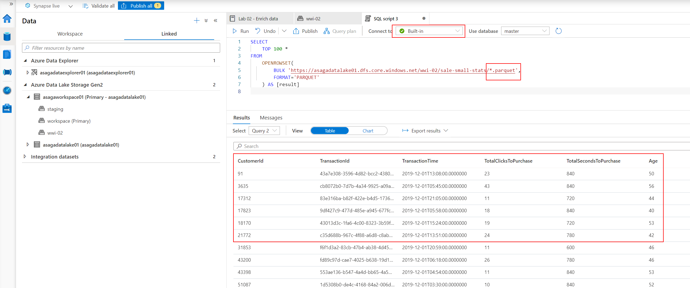

### Task 2 - Display enriched data in Power BI

First, you will publish the `Transaction Statistics` report to Power BI.

Download the `TransactionStatistics.pbix` file from the GitHub repo: https://github.com/solliancenet/azure-synapse-analytics-ga-content-packs/blob/main/hands-on-labs/lab-02/TransactionStatistics.pbix (select `Download` on the GitHub page).

Open the file with Power BI Desktop (ignore the warning about missing credentials). Also, if you are first prompted to update credentials, ignore the messages and close the pop-ups without updating the connection information.

In the `Home` section, select `Transform data`, then edit the `Source` entry in the `APPLIED STEPS` list of the `TransactionStatistics` query. Change the name of the server to `asagaworkspace<unique_suffix>-ondemand.sql.azuresynapse.net` (where `<unique_suffix>` is the unique suffix you provided when deploying the Synapse Analytics workspace). Also, ensure the Data Lake account name in the `SQL statement` textbox starts with `asagadatalake<unique_suffix>`.


The credentials window will pop up and promopt you to enter the credentials to connect to the Synapse Analytics SQL pool (in case it doesn't, select `Data source settings` on the ribbon, select your data source, select `Edit Permissions...`, and then select `Edit...` under `Credentials`).

In the credentials window, select `Microsoft account` and then select `Sign in`. Use your Power BI Pro account to sign in.

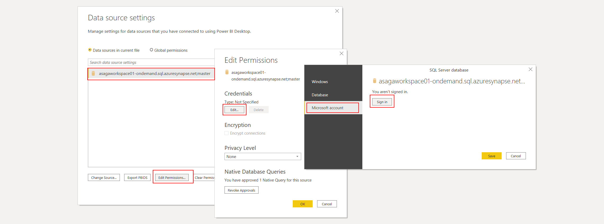

Close all open popup windows, select `Close & Apply` and then publish the file to your Power BI workspace.

To view the results of the report, in Synapse Studio, select the `Develop` hub on the left side, expand the `Power BI` section, and select the `TransactionStatistics` report under the `Power BI reports` section from your workspace.

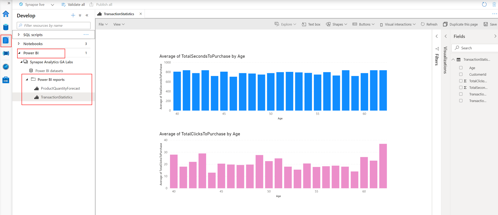

## After the hands-on lab

Follow the instructions in [Clean-up your subscription](./../setup/cleanup.md) to clean-up your environment after the hands-on lab.

## Resources

To learn more about the topics covered in this lab, use these resources:

- [Apache Spark in Azure Synapse Analytics](https://docs.microsoft.com/en-us/azure/synapse-analytics/spark/apache-spark-overview)
- [Announcing Azure Data Explorer data connector for Azure Synapse](https://techcommunity.microsoft.com/t5/azure-data-explorer/announcing-azure-data-explorer-data-connector-for-azure-synapse/ba-p/1743868)
- [Connect to Azure Data Explorer using Apache Spark for Azure Synapse Analytics](https://docs.microsoft.com/en-us/azure/synapse-analytics/quickstart-connect-azure-data-explorer)
- [Azure Synapse Analytics shared metadata](https://docs.microsoft.com/en-us/azure/synapse-analytics/metadata/overview)
- [Introduction of Microsoft Spark Utilities](https://docs.microsoft.com/en-us/azure/synapse-analytics/spark/microsoft-spark-utilities?pivots=programming-language-python)
- [Hyperspace - An open source indexing subsystem that brings index-based query acceleration to Apache Spark™ and big data workloads](https://github.com/microsoft/hyperspace)

## Report issues

In case you encounter any issues with the content in this repository, please follow the [How to report issues](./../../report-issues.md) guideline. We will try to address them as soon as possible. Please check your open issues to learn about their status.
