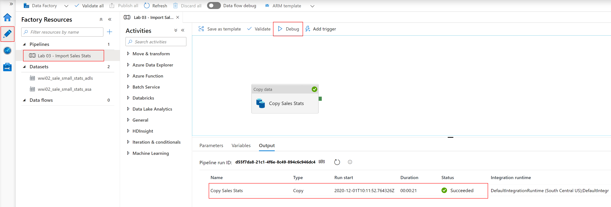
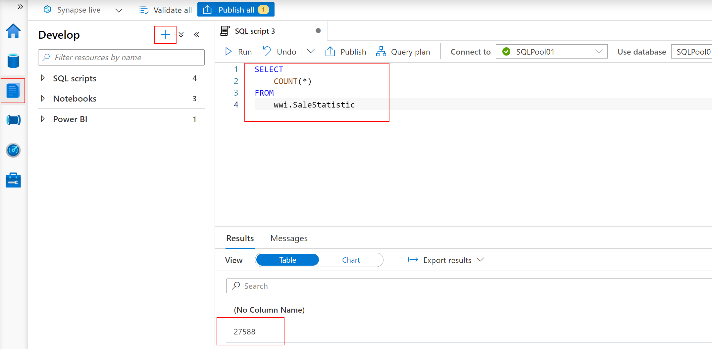
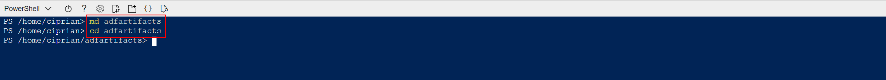
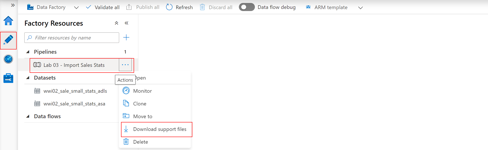
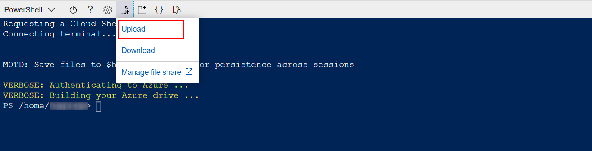
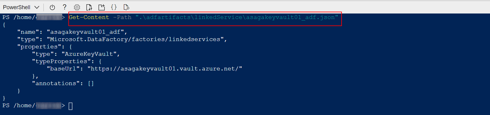
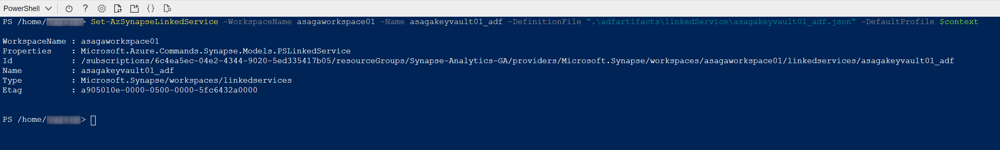

# Lab 03 - Migrating Data Factory Pipelines to Synapse Analytics Pipelines

This lab demonstrates the experience of migrating an existing Azure Data Factory pipeline to an Azure Synapse Analytics Pipeline. You will learn how to script major ADF artifacts like linked services, datasets, activities, and pipelines. You will also learn how to import these artifacts into Azure Synapse Analytics. In the end, you will learn to validate, test, and trigger the imported Azure Synapse Pipeline.

After completing the lab, you will understand the main steps of a migration process from Azure Data Factory pipelines to Azure Synapse Analytics pipelines.

>**NOTE**:
>
>There are more automated approaches possible to migrate existing ADF v2 artifacts to Synapse Analytics Pipeline. In this lab, we use a more manual approach to enable you to understand the details of the process.

This lab has the following structure:

- [Before the hands-on lab](#before-the-hands-on-lab)
  - [Task 1 - Create and configure the Azure Synapse Analytics workspace](#task-1---create-and-configure-the-azure-synapse-analytics-workspace)
  - [Task 2 - Create and configure additional resources for this lab](#task-2---create-and-configure-additional-resources-for-this-lab)
- [Exercise 1 - Script an Azure Data Factory (ADF) pipeline](#exercise-1---script-an-azure-data-factory-adf-pipeline)
  - [Task 1 - View and run the ADF pipeline](#task-1---view-and-run-the-adf-pipeline)
  - [Task 2 - Script an ADF pipeline and all its related components](#task-2---script-an-adf-pipeline-and-all-its-related-components)
- [Exercise 2 - Import a scripted ADF pipeline into Azure Synapse](#exercise-2---import-a-scripted-adf-pipeline-into-azure-synapse)
  - [Task 1 - Import linked services](#task-1---import-linked-services)
  - [Task 2 - Import datasets](#task-2---import-datasets)
  - [Task 3 - Import a pipeline](#task-3---import-a-pipeline)
- [Exercise 3 - Test the imported pipeline](#exercise-3---test-the-imported-pipeline)
  - [Task 1 - Validate and run the imported pipeline](#task-1---validate-and-run-the-imported-pipeline)
- [After the hands-on lab](#after-the-hands-on-lab)
- [Resources](#resources)
- [Report issues](#report-issues)

## Before the hands-on lab

Before stepping through the exercises in this lab, make sure you have properly configured your Azure Synapse Analytics workspace. Perform the tasks below to configure the workspace.

### Task 1 - Create and configure the Azure Synapse Analytics workspace

>**NOTE**
>
>If you have already created and configured the Synapse Analytics workspace while running one of the other labs available in this repo, you must not perform this task again and you can move on to the next task. The labs are designed to share the Synapse Analytics workspace, so you only need to create it once.

Follow the instructions in [Deploy your Azure Synapse Analytics workspace](./../setup/asa-workspace-deploy.md) to create and configure the workspace.

### Task 2 - Create and configure additional resources for this lab

Follow the instructions in [Deploy resources for Lab 03](./../setup/lab-03-deploy.md) to deploy additional resources for this lab. Once deployment is complete, you are ready to proceed with the exercises in this lab.

## Exercise 1 - Script an Azure Data Factory (ADF) pipeline

In this exercise you will run an existing Azure Data Factory v2 pipeline and then script its components. This will prepare the necessary inputs to re-create the pipeline as a Synapse Analytics Pipeline in your workspace.

### Task 1 - View and run the ADF pipeline

In the Azure Portal, select your Azure Data Factory v2 workspace and then select `Author & Monitor` to load the ADF designer. In the designer, select the `Author` hub on the left side, select the `Pipelines` section and then select the `Lab 03 - Import Sales Stats` pipeline. Start the pipeline in debug mode by selecting the `Debug` option on the toolbar and wait until the pipeline completes successfully.



In the Azure Portal, select your Synapse Analytics workspace and then select `Open Synapse Studio` to load Synapse Studio. In Synapse Studio, select the `Develop` hub on the left side, open a new SQL script and run the following statement on `SQLPool01`:

```sql
SELECT
    COUNT(*)
FROM    
    wwi.SaleStatistic
```

You should get a count of around 27.000 records which proves the ADF pipeline executed successfully.



Return to the ADF designer and explore the structure of the pipeline. Notice the following ADF objects:

- **Pipelines**: `Lab 03 - Import Sales Stats`
- **Datasets**: `wwi02_sale_small_stats_adls`, `wwi02_sale_small_stats_asa`
- **Linked services**: `asagakeyvault01`, `asagadatalake01`, `asagasqlpool01`

The reminder of this exercise covers the procedure to get the JSON templates associated with these objects.

### Task 2 - Script an ADF pipeline and all its related components

Open an Azure Cloud Shell instance and run `Connect-AzAccount -DeviceCode` to make sure you are authenticated with the right account.

Run the following commdands to create a working folder:

```cmd
md adfartifacts
cd adfartifacts
```



In the ADF designer, select the `...` to the righ of the `Lab 03 - Import Sales Stats` pipeline (appears when you hover over the pipeline name) and then select `Download support files`.



This will download a file named `Lab 03 - Import Sales Stats_support_live.zip` to your local computer. Once the download is complete, upload the file to the Azure Cloud Shell. Select the `Upload/download files` option from the Cloud Shell toolbar and select the ZIP file to upload.



Once the upload is complete, run the ```dir``` command to ensure the file exists in your home folder.


Next, run the following command to extract the content of the archive:

```powershell
Expand-Archive "Lab 03 - Import Sales Stats_support_live.zip" -DestinationPath ".\adfartifacts" -Force
```

Check the content of the various files that have been extracted. The ADF artifact definitions share the same schema with Synapse Analytics, so they can be imported into the Synapse Analytics workspace without any change.

Use the `Get-Content` command to display the content of files in the `adfartifacts` folder:

```powershell
Get-Content -Path ".\adfartifacts\linkedService\asagakeyvault01_adf.json"
```



Next, you will use these files to create the Synapse Analytics equivalents of the ADF v2 objects.

## Exercise 2 - Import a scripted ADF pipeline into Azure Synapse

In this exercise you will use the exported ADF v2 artifacts (in the form of JSON files) to create their Synapse Analytics equivalents.

### Task 1 - Import linked services

To make sure the current subscription content is correctly set, first run the following command:

```powershell
$context = Get-AzContext
$context
```

If the subscription name displayed does not match the name of the subscription where your Synapse Analytics workspace was created, run the following command (do not forget to replace `<subscription_name>` with the name of your subscription):

```powershell
$context = Select-AzSubscription -SubscriptionName "<subscription_name>"
$context
```

Run the following commands to create the three linked services in Synapse Analytics (remember to replace `<unique_suffix>` with the value you specified during the Synapse Analytics workspace deployment):

```powershell

Set-AzSynapseLinkedService -WorkspaceName asagaworkspace<unique_suffix> -Name asagakeyvault01_adf -DefinitionFile ".\adfartifacts\linkedService\asagakeyvault01_adf.json" -DefaultProfile $context
Set-AzSynapseLinkedService -WorkspaceName asagaworkspace<unique_suffix> -Name asagadatalake01_adf -DefinitionFile ".\adfartifacts\linkedService\asagadatalake01_adf.json" -DefaultProfile $context
Set-AzSynapseLinkedService -WorkspaceName asagaworkspace<unique_suffix> -Name asagasqlpool01_adf -DefinitionFile ".\adfartifacts\linkedService\asagasqlpool01_adf.json" -DefaultProfile $context

```

After each command, you should see an output similar to this:



### Task 2 - Import datasets

Run the following commands to create the two datasets in Synapse Analytics (remember to replace `<unique_suffix>` with the value you specified during the Synapse Analytics workspace deployment):

```powershell
Set-AzSynapseDataset -WorkspaceName asagaworkspace<unique_suffix> -Name wwi02_sale_small_stats_adls -DefinitionFile ".\adfartifacts\dataset\wwi02_sale_small_stats_adls.json" -DefaultProfile $context
Set-AzSynapseDataset -WorkspaceName asagaworkspace<unique_suffix> -Name wwi02_sale_small_stats_asa -DefinitionFile ".\adfartifacts\dataset\wwi02_sale_small_stats_asa.json" -DefaultProfile $context
```

### Task 3 - Import a pipeline

Run the following command to create the pipeline in Synapse Analytics (remember to replace `<unique_suffix>` with the value you specified during the Synapse Analytics workspace deployment):

```powershell
Set-AzSynapsePipeline -WorkspaceName asagaworkspace<unique_suffix> -Name "Lab 03 - Import Sales Stats" -DefinitionFile ".\adfartifacts\pipeline\Lab 03 - Import Sales Stats.json" -DefaultProfile $context
```

## Exercise 3 - Test the imported pipeline

In this exercise, you will test the Synapse Analytics pipeline that was imported from ADF vs.

### Task 1 - Validate and run the imported pipeline

In Synapse Studio, run the `Lab 03 - Import Sale Stats` pipeline.

## After the hands-on lab

Follow the instructions in [Clean-up your subscription](./../setup/cleanup.md) to clean-up your environment after the hands-on lab.

## Resources

To learn more about the topics covered in this lab, use these resources:

- [Azure.Analytics.Synapse.Artifacts Namespace
Classes](https://docs.microsoft.com/en-us/dotnet/api/azure.analytics.synapse.artifacts?view=azure-dotnet-preview)

## Report issues

In case you encounter any issues with the content in this repository, please follow the [How to report issues](./../../report-issues.md) guideline. We will try to address them as soon as possible. Please check your open issues to learn about their status.
