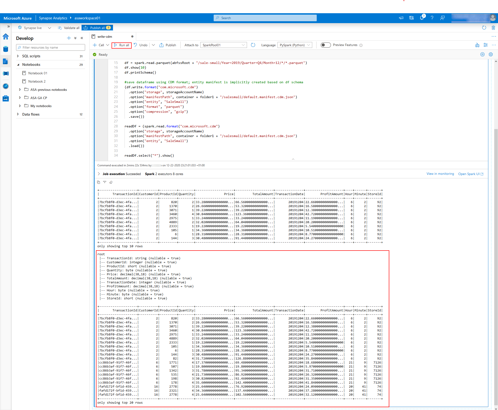
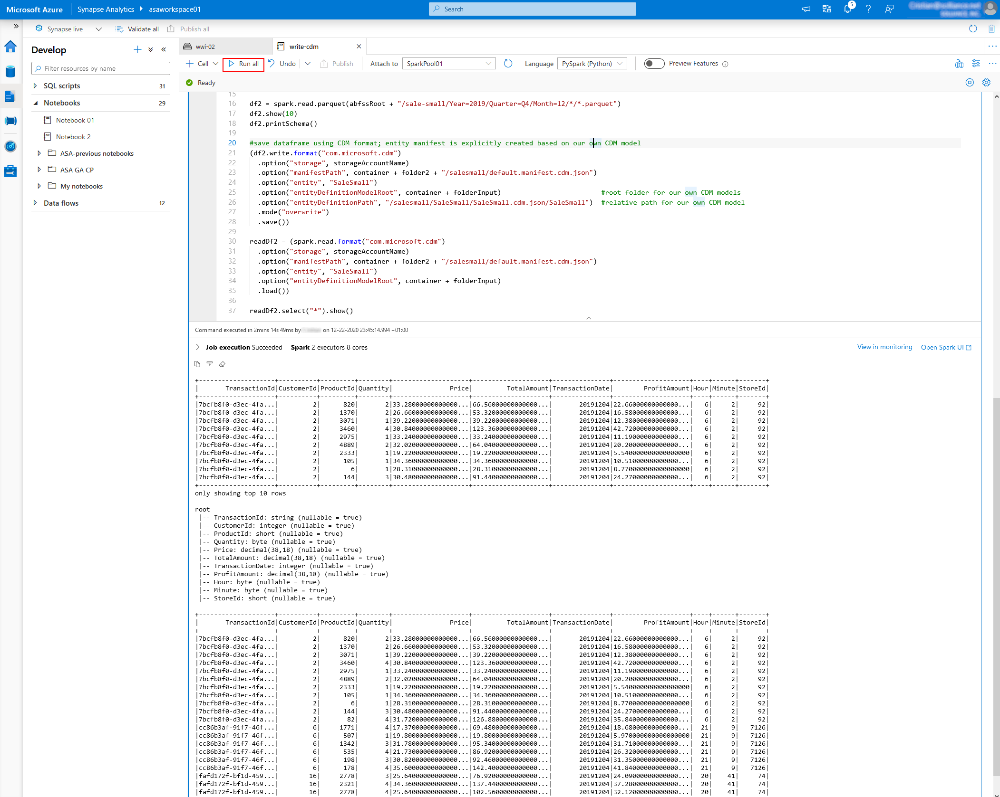

# Lab 04 - Working with the Common Data Model in Synapse Analytics

This lab demonstrates using Synapse Analytics Spark to work with the Common Data Model.

After completing the lab, you will know how to interact with the Common Data Model in Synapse Analytics.

- [Before the hands-on lab](#before-the-hands-on-lab)
- [Exercise 1 - Read data that exists in the CDM](#exercise-1---read-data-that-exists-in-the-cdm)
  - [Task 1 - Explore CDM data in the Synapse workspace data lake](#task-1---explore-cdm-data-in-the-synapse-workspace-data-lake)
  - [Task 2 - Load Spark dataframes from entities in CDM folders](#task-2---load-spark-dataframes-from-entities-in-cdm-folders)
- [Exercise 2 - Update data that exists in the CDM](#exercise-2---update-data-that-exists-in-the-cdm)
  - [Task 1 - Write data from Spark dataframes to CDM folders using dataframe schemas](#task-1---write-data-from-spark-dataframes-to-cdm-folders-using-dataframe-schemas)
  - [Task 2 - Write data from Spark dataframes to CDM folders using CDM entity definitions](#task-2---write-data-from-spark-dataframes-to-cdm-folders-using-cdm-entity-definitions)
  - [Task 3 - Use Spark to transform incoming raw data to CDM data](#task-3---use-spark-to-transform-incoming-raw-data-to-cdm-data)
- [Exercise 3 - Create an end-to-end CDM-based data pipeline](#exercise-3---create-an-end-to-end-cdm-based-data-pipeline)
  - [Task 1 - Automate raw data ingestion and coversion to CDM using Synapse Pipelines](#task-1---automate-raw-data-ingestion-and-coversion-to-cdm-using-synapse-pipelines)
  - [Task 2 - Use CDM data in Machine Learning](#task-2---use-cdm-data-in-machine-learning)
  - [Task 3 - View CDM data in Power BI](#task-3---view-cdm-data-in-power-bi)
- [After the hands-on lab](#after-the-hands-on-lab)
- [Resources](#resources)
- [Report issues](#report-issues)

## Before the hands-on lab

Before stepping through the exercises in this lab, make sure you have properly configured your Azure Synapse Analytics workspace. Perform the tasks below to configure the workspace.

### Task 1 - Create and configure the Azure Synapse Analytics workspace

>**NOTE**
>
>If you have already created and configured the Synapse Analytics workspace while running one of the other labs available in this repo, you must not perform this task again and you can move on to the next task. The labs are designed to share the Synapse Analytics workspace, so you only need to create it once.

Follow the instructions in [Deploy your Azure Synapse Analytics workspace](./../setup/asa-workspace-deploy.md) to create and configure the workspace.

### Task 2 - Create and configure additional resources for this lab

Details coming soon ...

## Exercise 1 - Read data that exists in the CDM

### Task 1 - Explore CDM data in the Synapse workspace data lake

Our CDM data is already stored on Azure Data Lake Gen 2. 

We have to open the corresponding container/folder:


To view the actual data, we can use a SQL query. Right click on the corresponding data folder and choose `New SQL Script` then choose `Select TOP 100 rows`


Click the `Run` button in the toolbar to execute the SQL query. Once executed, results are visible in the lower pane.


Alternately we can load the CDM data in a Spark dataframe


Choose a Spark pool first, then click the `Run` button in the toolbar to run the notebook. Once executed, results are visible in the lower pane.


### Task 2 - Load Spark dataframes from entities in CDM folders

We will load the existing CDM data into Spark dataframes. Open a notebook and use the following python code to load the CDM data:

```python
from pyspark.sql.types import *
from pyspark.sql import functions, Row
from decimal import Decimal
from datetime import datetime


storageAccountName = "asadatalake01.dfs.core.windows.net"
container = "wwi-02"
outputContainer = "wwi-02"

abfssRoot = "abfss://" + outputContainer + "@" + storageAccountName

folder1 = "/cdm-data/input"

#read CDM entities
df = (spark.read.format("com.microsoft.cdm")
  .option("storage", storageAccountName)
  .option("manifestPath", container + folder1 + "/salesmall/default.manifest.cdm.json")
  .option("entity", "SaleSmall")
  .load())

df.printSchema()

df.select("*").show()
```

The loaded CDM data is now displayed as spark dataframes in the lower pane. 

The dataframe schema matches the structure of our CDM entity.


Note how our manifest file `default.manifest.cdm.json` points to our model

```json
...
  "entities" : [
    {
      "type" : "LocalEntity",
      "entityName" : "SaleSmall",
      "entityPath" : "SaleSmall/SaleSmall.cdm.json/SaleSmall",
    }
  ]
...
```

which in turn contains our entity's definition `SaleSmall`.

Some contents of `SaleSmall.cdm.json` is skipped for brevity:

```json
{
  "definitions" : [
    {
      "entityName" : "SaleSmall",
      "attributeContext" : {
        "type" : "entity",
        "name" : "SaleSmall",
        "definition" : "resolvedFrom/SaleSmall",
        "contents" : [
          ...
        ]
      },
      "hasAttributes" : [
        {
          "name" : "TransactionId",
          "dataFormat" : "String"
        },
        {
          "name" : "CustomerId",
          "dataFormat" : "Int32"
        },
        {
          "name" : "ProductId",
          "dataFormat" : "Int16"
        },
        {
          "name" : "Quantity",
          "dataFormat" : "Byte"
        },
        {
          "name" : "Price",
          "dataFormat" : "Decimal"
        },
        {
          "name" : "TotalAmount",
          "dataFormat" : "Decimal"
        },
        {
          "name" : "TransactionDate",
          "dataFormat" : "Int32"
        },
        {
          "name" : "ProfitAmount",
          "dataFormat" : "Decimal"
        },
        {
          "name" : "Hour",
          "dataFormat" : "Byte"
        },
        {
          "name" : "Minute",
          "dataFormat" : "Byte"
        },
        {
          "name" : "StoreId",
          "dataFormat" : "Int16"
        }
      ]
    }
  ]
}
```

## Exercise 2 - Update data that exists in the CDM

### Task 1 - Write data from Spark dataframes to CDM folders using dataframe schemas

We will write new CDM data based on existing Spark dataframes. 

Open a notebook and use the following python code to save the CDM data:

```python
storageAccountName = "asadatalake01.dfs.core.windows.net"
container = "wwi-02"
outputContainer = "wwi-02"

abfssRoot = "abfss://" + outputContainer + "@" + storageAccountName

# WARNING: if output folder exists, writer will fail with a java.lang.NullPointerException
folder1 = "/cdm-data/output"

from pyspark.sql.types import *
from pyspark.sql import functions, Row
from decimal import Decimal
from datetime import datetime

df = spark.read.parquet(abfssRoot + "/sale-small/Year=2019/Quarter=Q4/Month=12/*/*.parquet")
df.show(10)
df.printSchema()

#save dataframe using CDM format; entity manifest is implicitly created based on df schema
(df.write.format("com.microsoft.cdm")
  .option("storage", storageAccountName)
  .option("manifestPath", container + folder1 + "/salesmall/default.manifest.cdm.json")
  .option("entity", "SaleSmall")
  .option("format", "parquet")
  .option("compression", "gzip")
  .save())

readDf = (spark.read.format("com.microsoft.cdm")
  .option("storage", storageAccountName)
  .option("manifestPath", container + folder1 + "/salesmall/default.manifest.cdm.json")
  .option("entity", "SaleSmall")
  .load())

readDf.select("*").show()
```


### Task 2 - Write data from Spark dataframes to CDM folders using CDM entity definitions

Writing new CDM data based on existing CDM models is just as easy. 

Open a notebook and use the following python code to save the CDM data:

```python
storageAccountName = "asadatalake01.dfs.core.windows.net"
container = "wwi-02"
outputContainer = "wwi-02"

abfssRoot = "abfss://" + outputContainer + "@" + storageAccountName

# WARNING: if output folder exists, writer will fail with a java.lang.NullPointerException
folderInput = "/cdm-data/input"
folder2 = "/cdm-data/output2"

from pyspark.sql.types import *
from pyspark.sql import functions, Row
from decimal import Decimal
from datetime import datetime

df2 = spark.read.parquet(abfssRoot + "/sale-small/Year=2019/Quarter=Q4/Month=12/*/*.parquet")
df2.show(10)
df2.printSchema()

#save dataframe using CDM format; entity manifest is explicitly created based on our own CDM model
(df2.write.format("com.microsoft.cdm")
  .option("storage", storageAccountName)
  .option("manifestPath", container + folder2 + "/salesmall/default.manifest.cdm.json")
  .option("entity", "SaleSmall")
  .option("entityDefinitionModelRoot", container + folderInput)                         #root folder for our own CDM models
  .option("entityDefinitionPath", "/salesmall/SaleSmall/SaleSmall.cdm.json/SaleSmall")  #relative path for our own CDM model
  .mode("overwrite")
  .save())

readDf2 = (spark.read.format("com.microsoft.cdm")
  .option("storage", storageAccountName)
  .option("manifestPath", container + folder2 + "/salesmall/default.manifest.cdm.json")
  .option("entity", "SaleSmall")
  .option("entityDefinitionModelRoot", container + folderInput)
  .load())

readDf2.select("*").show()
```



### Task 3 - Use Spark to transform incoming raw data to CDM data

## Exercise 3 - Create an end-to-end CDM-based data pipeline

### Task 1 - Automate raw data ingestion and coversion to CDM using Synapse Pipelines

### Task 2 - Use CDM data in Machine Learning 

### Task 3 - View CDM data in Power BI

## After the hands-on lab

Follow the instructions in [Clean-up your subscription](./../setup/cleanup.md) to clean-up your environment after the hands-on lab.

## Resources

To learn more about the topics covered in this lab, use these resources:

- [Azure.Analytics.Synapse.Artifacts Namespace Classes](https://docs.microsoft.com/en-us/dotnet/api/azure.analytics.synapse.artifacts?view=azure-dotnet-preview)
- [Using the Spark CDM Connector](https://github.com/Azure/spark-cdm-connector/blob/master/documentation/overview.md)
- [Common Data Model (CDM) Schema](https://github.com/microsoft/CDM)


## Report issues

In case you encounter any issues with the content in this repository, please follow the [How to report issues](./../../report-issues.md) guideline. We will try to address them as soon as possible. Please check your open issues to learn about their status.
