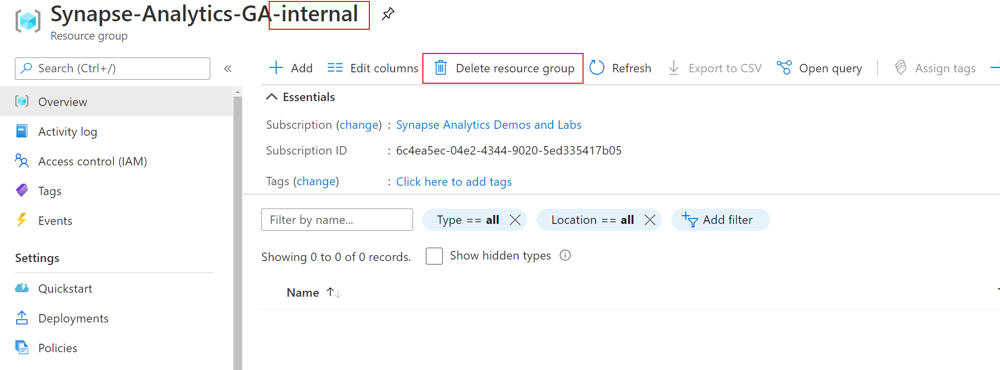

# Clean-up your subscription

This section provides instructions on how to clean-up your subscription after you complete one or more hands-on labs.

>**IMPORTANT**
>
>If you plan to run other labs that are available in this repo as well, you should defer the clean-up process until you complete all the labs you are interested in. The labs are designed to share the same Synapse Analytics workspace so you are not required to setup the workspace separately for each lab. Keep in mind though that once provisioned, resources generate costs, so, if you are not planning to run labs in sequence (i.e. there will be longer times between labs) you should either pause resources or perform this clean-up procedure and re-provision the environment at a later time.
>
>In case you decide to pause resources, follow these guidelines to minimize costs:
>
> - Ensure you pause all SQL Pools in the Synapse Analytics workspace
> - Ensure you stop the Azure Data Explorer cluster (if aplicable).

To clean-up your subscription, you need to delete the resource group you provided when deploying the Synapse Analytics workpace and the internal resource group that was automatically created during the deployment process (see [Deploy your Synapse Analytics workspace](./deploy-asa-workspace.md) for details).

To delete the resource group you provided when deploying the Synapse Analytics workspace, open the Azure Portal, navigate to the resource group, and then select `Delete resource group`.

The name of the internal resource group that was automaticall created during the deployment process is `<main_resource_group_name>-internal`, where `<main_resource_group_name>` is the name of the resource group you provided when deploying the Synapse Analytics workspace. To delete the internal resource group, open the Azure Portal, navigate to the resource group, and the select `Delete resource group`:

Your subscription has been now successfully cleaned-up.

## Report issues

In case you encounter any issues with the content in this repository, please follow the [How to report issues](./../../report-issues.md) guideline. We will try to address them as soon as possible. Please check your open issues to learn about their status.
