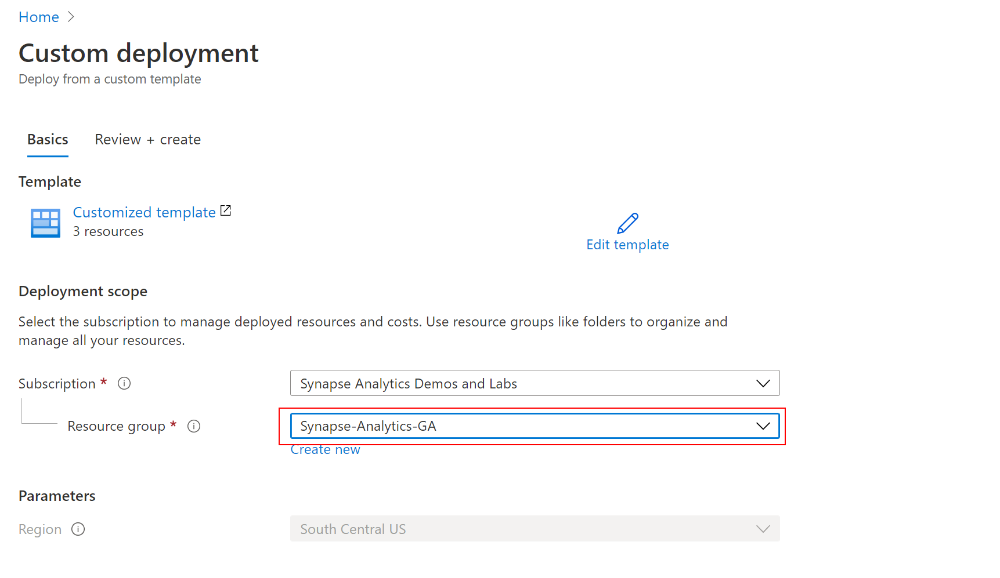
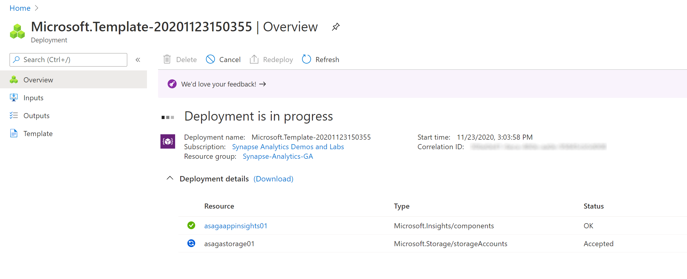

# Deploy resources for Lab 01

## Deploy services for the lab

Click the `Deploy to Azure` button below to start the deployment process.

You should see next the `Custom deployment` screen where you need to provide the resource group where the Synapse Analytics workspace was deployed (see [Pre-requisites for deployment](./asa-workspace-deploy.md#pre-requisites-for-deployment) for details):

Select `Review + create` to validate the settings.

Once the validation is passed, select `Create` to start the deployment. You should see next an indication of the deployment progress:

Wait until the deployment completes successfully before proceeding to the next step.
