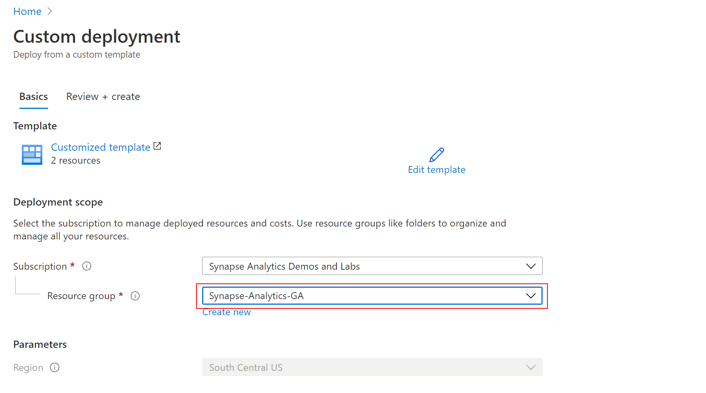
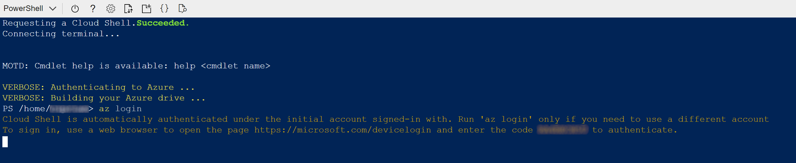
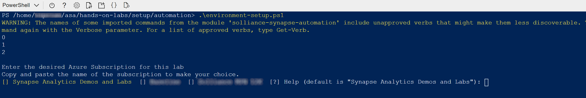
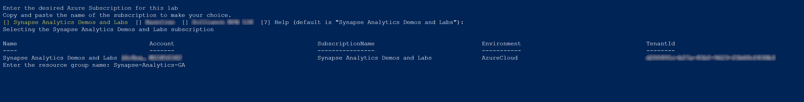

# Deploy resources for Lab 02

## Deploy services for the lab

Click the `Deploy to Azure` button below to start the deployment process.

[](https://portal.azure.com/#create/Microsoft.Template/uri/https%3A%2F%2Fraw.githubusercontent.com%2Fsolliancenet%2Fazure-synapse-analytics-ga-content-packs%2Fmain%2Fhands-on-labs%2Fsetup%2Farm%2Fasaga-workspace-lab-02.json%3Ftoken%3DAA2FKXURSMJAZDFEIRRDZVK7Z3WVC)

You should see next the `Custom deployment` screen where you need to provide the resource group where the Synapse Analytics workspace was deployed (see [Pre-requisites for deployment](./asa-workspace-deploy.md#pre-requisites-for-deployment) for details):

Select `Review + create` to validate the settings.



Once the validation is passed, select `Create` to start the deployment. You should see next an indication of the deployment progress:


Wait until the deployment completes successfully before proceeding to the next step.

In the Azure Portal, navigate to the resource group you used to deploy the Synapse Analytics workspace (see [Pre-requisites for deployment](./asa-workspace-deploy.md#pre-requisites-for-deployment) for details) and start a Cloud Shell instance (see [Configure the Azure Cloud Shell](#configure-the-azure-cloud-shell) above for details).

Once the Cloud Shell instance becomes available, run ```az login``` to make sure the correct account and subscription context are set:



Run the following command to make sure the Git repository has been correctly cloned (see [Run the global setup script in Cloud Shell](./asa-workspace-deploy.md#run-the-global-setup-script-in-cloud-shell) for details):

```cmd
dir
```

Change your current directory using

```cmd
cd asa/hands-on-labs/setup/automation
```

and then start the setup script using

```powershell
.\lab-02-setup.ps1
```

Make sure the selected subscription is the one that contains the resource group where you deployed the Synapse Analytics workspace:



Enter the name of the resource group where you deployed the Synapse Analytics workspace:



The setup script will now proceed to create all necesary Synapse Analytics artifacts in your environment.

The process should take a few minutes to finish. Once it completes successfully, you have completed the deployment of the lab.

## Report issues

In case you encounter any issues with the content in this repository, please follow the [How to report issues](./../../report-issues.md) guideline. We will try to address them as soon as possible. Please check your open issues to learn about their status.
