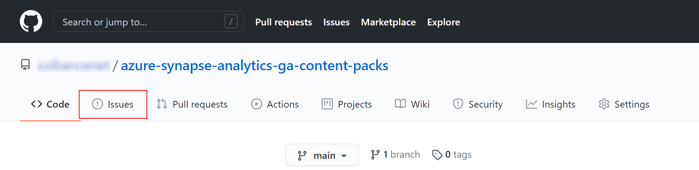
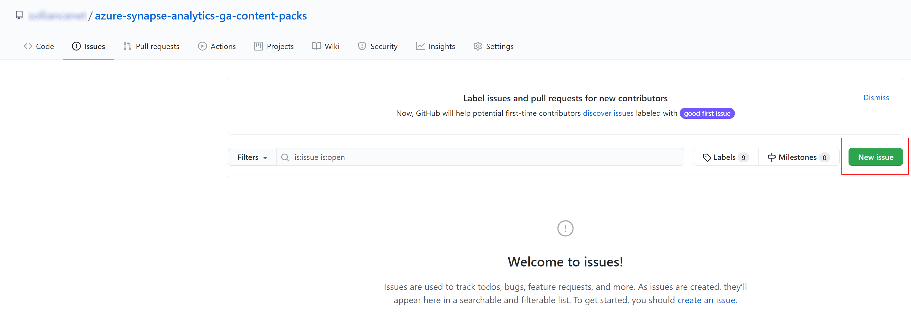
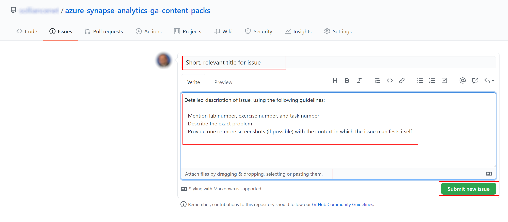

# How to report issues

We are maintaining the content in this repo using GitHub's issue management process. To submit a new issue, please follow these steps:

- Open the repo page in GitHub and select the `Issues` section.

    

- Select `New issue` to create a new issue.

    

- Provide a short, relevant title for the issue (that also makes it easy for you to find it when multiple issues are open in the same time). Also, provide the detailed description of the issue and mention the lab number, exercise number, and task number. It is usually very helpful to attach one or more screenshots with the context in which the issue manifests itself (you can attach files by either pasting them directly or by dragging and dropping). Select `Submit new issue` once you are done.

    

>**NOTE**:
>
>Once your issue is submitted, you can return any time to check it's status. It is recommended to check it periodically, as we might respond with comments to the issue's thread (either explaining things or asking for more details in case they are needed).