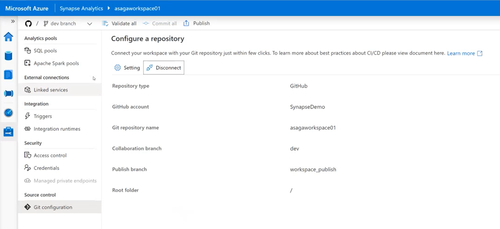

# Azure Synapse Analytics Git integration and workspace management

This video provides an overview of the new Git integration features in Synapse Analytics as well as some of other features related to workspace management (folders and worskpace access control). The following topics are covered:

- Configuring a Git repository for a Synapse Analytics workspace
- Differences between the collaboration and publish branches
- Committing Synapse artifacts to the Git repo
- Publishing into the publish branch
- Deploying from the publish branch into a production Synapse workspace using an Azure DevOps release pipeine (and the `Synapse workspace deployment` DevOps extension)
- Organizing Synapse artifacts using folders
- New security roles available in Synapse Analytics

Click on the image below to start the video.

## Report issues

In case you encounter any issues with the content in this repository, please follow the [How to report issues](./../report-issues.md) guideline. We will try to address them as soon as possible. Please check your open issues to learn about their status.
