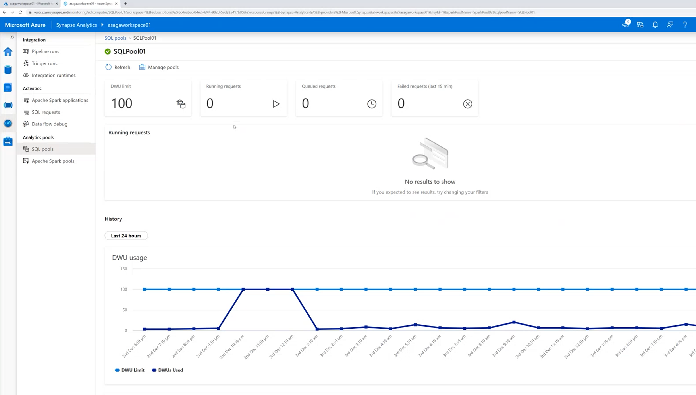

# Azure Synapse Analytics monitoring

This video provides an overview of the new monitoring capabilities in Synapse Analytics. It covers Az Monitor integration as well as SQL and Spark pool monitoring.

Click on the image below to start the video.

## Report issues

In case you encounter any issues with the content in this repository, please follow the [How to report issues](./../report-issues.md) guideline. We will try to address them as soon as possible. Please check your open issues to learn about their status.
