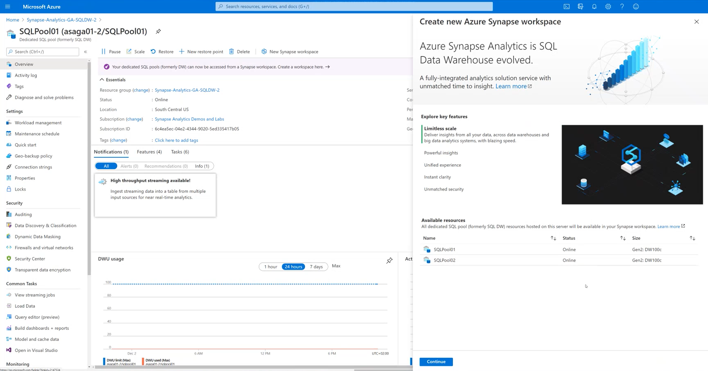

# Adding an Azure Synapse Analytics workspace to an existing Azure SQL Data Warehouse instance

This video provides an overview on how to add an Azure Synapse Analytics workspace on top of an existing Azure Synapse Analytics (formerly SQL DW) instance. A logical SQL server with two dedicated SQL pools (SQL Data Warehouses) gets a full Synapse Analytics workspace added on top of it. SQL pool data availability and some specific Synapse Analytics workspace details are also showcased.

Click on the image below to start the video.

## Report issues

In case you encounter any issues with the content in this repository, please follow the [How to report issues](./../report-issues.md) guideline. We will try to address them as soon as possible. Please check your open issues to learn about their status.
